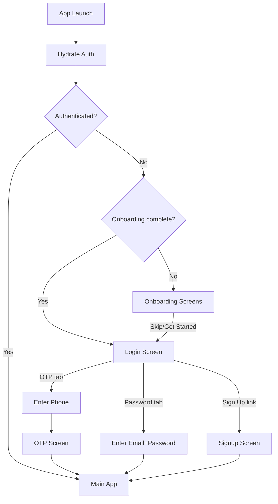

# Design Document: Auth & Onboarding Enhancement

## Overview

This design covers the architecture for enhancing the Clenzey authentication and onboarding experience across both the Consumer and Partner apps. The changes span multiple layers of the monorepo:

1. **Design System** — Font upgrade (Inter → Poppins), TextInput outline fix, new shared components (AuthBackground, Logo)
2. **Onboarding** — A shared onboarding flow component with app-specific content, persisted completion state via AsyncStorage
3. **Auth Screens** — Redesigned Login with OTP/password tabs, new Signup screen, decorative backgrounds
4. **API Layer** — New service functions for email/password signin and signup endpoints

The goal is a polished, branded first-run and authentication experience while keeping the shared design system as the single source of truth for styling and reusable components.

## Architecture

```mermaid
graph TD
    subgraph "packages/design-system"
        DS_Fonts[useFonts hook - Poppins]
        DS_Theme[Theme - typography, colors]
        DS_TextInput[TextInput - outline fix]
        DS_AuthBg[AuthBackground component]
        DS_Logo[Logo component]
    end

    subgraph "apps/consumer"
        C_Layout[_layout.tsx - font loading + auth guard]
        C_Onboarding[onboarding.tsx]
        C_Login[login.tsx - tabs: OTP | Password]
        C_Signup[signup.tsx]
        C_OTP[otp.tsx]
        C_API[src/lib/api.ts - signin/signup endpoints]
        C_Store[src/store/auth.ts]
    end

    subgraph "apps/partner"
        P_Layout[_layout.tsx - font loading + auth guard]
        P_Onboarding[onboarding.tsx]
        P_Login[login.tsx - tabs: OTP | Password]
        P_Signup[signup.tsx]
        P_OTP[otp.tsx]
        P_API[src/lib/api.ts - signin/signup endpoints]
        P_Store[src/store/auth.ts]
    end

    DS_Fonts --> C_Layout
    DS_Fonts --> P_Layout
    DS_Theme --> C_Login
    DS_Theme --> P_Login
    DS_TextInput --> C_Login
    DS_TextInput --> P_Login
    DS_AuthBg --> C_Login
    DS_AuthBg --> P_Login
    DS_AuthBg --> C_OTP
    DS_AuthBg --> P_OTP
    DS_AuthBg --> C_Signup
    DS_AuthBg --> P_Signup
    DS_Logo --> C_Login
    DS_Logo --> P_Login
    DS_Logo --> C_Signup
    DS_Logo --> P_Signup
    C_Login --> C_API
    C_Signup --> C_API
    P_Login --> P_API
    P_Signup --> P_API
    C_API --> C_Store
    P_API --> P_Store
```

### Routing Structure (expo-router file-based)

Both apps get an identical route structure under `app/(auth)/`:

```
app/
├── (auth)/
│   ├── _layout.tsx        # Stack navigator, headerShown: false
│   ├── onboarding.tsx     # NEW - swipeable intro screens
│   ├── login.tsx          # REDESIGNED - OTP/Password tabs + logo + background
│   ├── signup.tsx         # NEW - registration form
│   └── otp.tsx            # EXISTING - minor visual update (add background)
├── _layout.tsx            # MODIFIED - font loading, onboarding check
└── ...
```

### Navigation Flow



## Components and Interfaces

### 1. Design System — New & Modified Components

#### `AuthBackground` (NEW)

A decorative background component rendered behind auth screen content using SVG/View-based shapes.

```typescript
interface AuthBackgroundProps {
  variant: 'consumer' | 'partner';
  children: React.ReactNode;
}
```

- Renders 2–3 abstract shapes (circles, rounded rectangles) using theme colors (`tertiary`, `secondary` at low opacity)
- Positions shapes absolutely behind children
- Scales proportionally with screen dimensions via `useWindowDimensions()`
- Exported from `packages/design-system/src/components/AuthBackground.tsx`

#### `Logo` (NEW)

Displays the Clenzey brand logo as an image.

```typescript
interface LogoProps {
  width?: number;   // default 160
  style?: ViewStyle;
}
```

- Renders an `<Image>` from a shared asset in `packages/design-system/assets/logo.png`
- Maintains aspect ratio with `resizeMode="contain"`
- Horizontally centered by default
- If image fails to load, renders nothing (zero height) via an `onError` handler that sets display to `none`
- Exported from `packages/design-system/src/components/Logo.tsx`

#### `TextInput` (FIX)

Add `outlineStyle: 'none'` to the RNTextInput style to suppress the web/native focus outline:

```typescript
// In the style array for <RNTextInput>
{
  outlineStyle: 'none', // suppress default focus outline
}
```

This is a one-line addition to the existing `styles.input` or inline style in `TextInput.tsx`.

#### `OnboardingScreen` (NEW — app-level shared pattern)

Rather than a design-system export (since content is app-specific), each app will use a shared pattern:

```typescript
interface OnboardingSlide {
  id: string;
  title: string;
  description: string;
  image: ImageSourcePropType;
}

interface OnboardingScreenProps {
  slides: OnboardingSlide[];
  onComplete: () => void;
}
```

- Implemented with `FlatList` (horizontal, pagingEnabled) or `react-native-pager-view`
- Page indicator dots at the bottom
- "Skip" button (top-right), "Next"/"Get Started" button (bottom)
- On complete/skip: persist flag via `AsyncStorage.setItem('onboarding_completed', 'true')` and navigate to login

### 2. Font Upgrade — Poppins

#### `useFonts.ts` update

Replace Inter with Poppins:

```typescript
import {
  Poppins_400Regular,
  Poppins_600SemiBold,
  Poppins_700Bold,
} from '@expo-google-fonts/poppins';

export function useDesignSystemFonts() {
  return useExpoFonts({
    Poppins_400Regular,
    Poppins_600SemiBold,
    Poppins_700Bold,
  });
}
```

#### `theme/index.ts` typography update

```typescript
export const typography = {
  fontFamily: 'Poppins',
  headline1: { fontFamily: 'Poppins_700Bold', fontSize: 32, fontWeight: '700' },
  headline2: { fontFamily: 'Poppins_700Bold', fontSize: 28, fontWeight: '700' },
  headline3: { fontFamily: 'Poppins_700Bold', fontSize: 24, fontWeight: '700' },
  body1:     { fontFamily: 'Poppins_400Regular', fontSize: 16, fontWeight: '400' },
  body2:     { fontFamily: 'Poppins_400Regular', fontSize: 14, fontWeight: '400' },
  label:     { fontFamily: 'Poppins_600SemiBold', fontSize: 12, fontWeight: '600' },
} as const;
```

#### Fallback strategy

Both app root layouts already gate rendering on `fontsLoaded`. Add a 5-second timeout: if fonts haven't loaded in 5 seconds, proceed with system font fallback. The timeout is implemented with a `setTimeout` + state flag in the root layout.

### 3. Login Screen — Tabbed Auth

The redesigned login screen uses a simple custom tab bar (two pressable segments) to switch between OTP login and email/password login.

```typescript
type AuthMode = 'otp' | 'password';

// Internal state
const [mode, setMode] = useState<AuthMode>('otp');
```

**OTP mode** — identical to current behavior (phone input → send OTP → navigate to OTP screen).

**Password mode** — shows identifier (email or phone) + password fields → POST to signin endpoint → store token → navigate.

### 4. Signup Screen

```typescript
// Consumer fields
interface ConsumerSignupForm {
  email: string;
  phone: string;      // 10 digits, displayed with +91 prefix
  password: string;
}

// Partner fields (extends consumer)
interface PartnerSignupForm extends ConsumerSignupForm {
  fullName: string;
}
```

Validation rules (client-side, run on every change to enable/disable submit):
- `email`: standard email regex (`/^[^\s@]+@[^\s@]+\.[^\s@]+$/`)
- `phone`: exactly 10 digits
- `password`: 6–128 characters
- `fullName` (partner only): 2–100 characters

### 5. API Service Layer Additions

Add to `@clenzey/api-client` (or directly in each app's `src/lib/api.ts`):

```typescript
// Consumer
async function consumerSignIn(identifier: string, password: string) {
  return apiClient.post('/api/v1/consumers/auth/signin', { identifier, password });
}

async function consumerSignUp(data: { email: string; password: string; phone: string }) {
  return apiClient.post('/api/v1/consumers/auth/signup', data);
}

// Partner
async function partnerSignIn(identifier: string, password: string) {
  return apiClient.post('/api/v1/partners/auth/signin', { identifier, password });
}

async function partnerSignUp(data: { email: string; fullName: string; password: string; phone: string }) {
  return apiClient.post('/api/v1/partners/auth/signup', data);
}
```

Response shape (shared):
```typescript
interface AuthResponse {
  accessToken: string;
  user: {
    id: string;
    email: string;
    phone: string;
    fullName: string;
    createdAt: string;
    updatedAt: string;
    approvalStatus?: 'APPROVED' | 'PENDING' | 'REJECTED'; // partner only
  };
}
```

## Data Models

### Onboarding State

```typescript
// Stored via AsyncStorage (not SecureStore — not sensitive)
const ONBOARDING_KEY = 'onboarding_completed'; // value: 'true' | null
```

Read on app launch in root layout. If `null` or read fails → show onboarding. If `'true'` → skip to login.

### Auth Store Extensions

The existing `useAuthStore` shape remains unchanged. The `setToken` and `setUser` methods are already generic enough to support both OTP-based and password-based flows. No schema changes needed.

### Form Validation Models

```typescript
interface ValidationResult {
  isValid: boolean;
  errors: Record<string, string>;  // field name → error message
}

// Validator functions (pure, testable)
function validateEmail(email: string): string | null;
function validatePhone(phone: string): string | null;
function validatePassword(password: string): string | null;
function validateFullName(name: string): string | null; // partner only

function validateSignupForm(form: ConsumerSignupForm | PartnerSignupForm): ValidationResult;
function validateLoginForm(identifier: string, password: string): ValidationResult;
```

These are pure functions living in a shared `src/utils/validation.ts` per app (or in a shared package if warranted).


## Error Handling

### Network Errors (API calls)
- All signin/signup API calls are wrapped in try/catch
- On network failure: display a user-friendly message ("Something went wrong. Please check your connection and try again.")
- On API error (4xx/5xx): display the error message from the response body (`response.data.message`)
- Loading state is always reset in `finally` block to prevent stuck UI

### Font Loading Failure
- If fonts fail to load within 5 seconds, the app proceeds with system default fonts
- A `setTimeout` in root layout sets `fontTimedOut = true` which allows rendering even if `fontsLoaded` is false
- The theme typography falls back to platform sans-serif (`System` on iOS, `Roboto` on Android)

### AsyncStorage Errors (Onboarding)
- If reading `onboarding_completed` throws, default to showing onboarding (safe fallback)
- If writing the flag throws, the user may see onboarding again next launch (acceptable UX degradation, no crash)

### Image Loading Failure (Logo)
- Logo component uses `onError` callback to set internal state that hides the image
- Layout does not reserve space for a failed logo (prevents blank gaps)

### Form Validation
- Client-side validation runs on change; submit button stays disabled until all fields pass
- Server-side validation errors are displayed below the form after a failed request
- Form field values are preserved on error so users don't lose input

## Correctness Properties

### Property 1: Onboarding Idempotency
Once `AsyncStorage_Flag` is set to `'true'`, the onboarding flow is never shown again regardless of how many times the app is launched.

**Validates: Requirements 1.6, 1.7, 1.8, 1.9**

### Property 2: Auth State Consistency
After a successful signin/signup, both `accessToken` and `user` are set atomically in the store before navigation occurs. There is no intermediate state where one is set but not the other.

**Validates: Requirements 6.6, 6.7, 7.7, 7.8**

### Property 3: Token Persistence
The access token is always written to SecureStore before navigating away from auth screens, ensuring auth state survives app restarts.

**Validates: Requirements 6.6, 6.7, 7.7, 7.8**

### Property 4: Input Validation Determinism
Given the same input string, validation functions always return the same result (pure functions, no side effects).

**Validates: Requirements 6.10, 6.13, 7.10, 7.14, 7.15**

### Property 5: Tab State Isolation
Switching between OTP and Password tabs does not carry over form state — each tab manages its own fields independently.

**Validates: Requirements 6.3**

### Property 6: Navigation Guard Correctness
The root layout auth guard handles all edge cases: unauthenticated users cannot reach protected screens, authenticated users cannot go back to auth screens.

**Validates: Requirements 1.8, 1.9, 6.6, 6.7**

## Testing Strategy

### Unit Tests
- **Validation functions** (`validateEmail`, `validatePhone`, `validatePassword`, `validateFullName`): Pure function tests with edge cases (empty string, max length, special characters, international formats)
- **Auth store actions**: Test `setToken`, `setUser`, `logout`, `hydrate` with mocked SecureStore

### Component Tests
- **TextInput**: Verify `outlineStyle: 'none'` is applied; verify border color changes on focus
- **Logo**: Verify renders with correct dimensions; verify graceful fallback on image error
- **AuthBackground**: Verify renders without crashing; verify children are accessible

### Integration Tests
- **Login flow (password mode)**: Mock API → enter credentials → verify API called with correct payload → verify navigation on success
- **Signup flow**: Mock API → fill form → submit → verify API called → verify navigation
- **Onboarding flow**: Verify 3 screens render → verify Skip navigates to login → verify AsyncStorage flag is set

### Manual Testing
- Visual inspection of decorative backgrounds across device sizes
- Font rendering verification on iOS and Android
- Onboarding swipe gesture testing on physical devices
