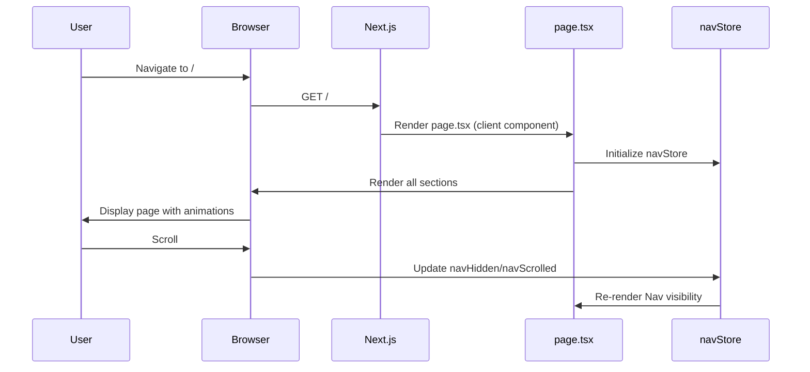
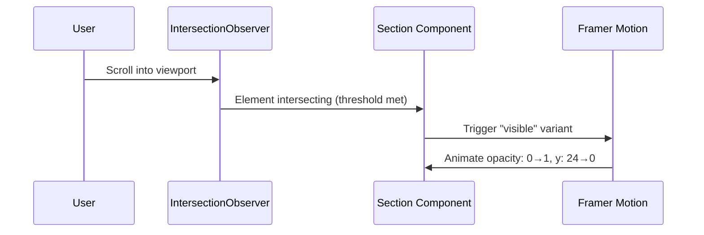

# Design Document: Landing Page Redesign

## Overview

The Clenzey landing page redesign transitions the current deep-navy aesthetic to a Material Design 3-inspired "Hydro-Professional" design system. The new design uses a monochromatic blue palette (#005d90 primary), glassmorphism elements, Plus Jakarta Sans typography, and a cleaner section-based layout. The redesign removes complex phone mockup components and carousel interactions in favor of a simpler, image-driven hero section and card-based content layout with subtle Framer Motion animations.

The page consists of 10 sections: Nav, Hero (with trusted badge, headline, service quick-select, and stat badges), Why/Features (icon cards), Services (2×2 image grid), How It Works (3-step numbered flow), Testimonials (rating + quote cards), CTA (dark primary background with dual buttons), Safety (feature cards), Support (3 help channels), and Footer (links + app badges).

## Architecture

```mermaid
graph TD
    A[app/layout.tsx] --> B[app/page.tsx]
    B --> C[Nav.tsx]
    B --> D[Drawer.tsx]
    B --> E[HeroSection.tsx]
    B --> F[WhySection.tsx]
    B --> G[ServicesSection.tsx]
    B --> H[HowSection.tsx]
    B --> I[TestimonialsSection.tsx]
    B --> J[WaitlistSection.tsx → CTA]
    B --> K[SafetySection.tsx - NEW]
    B --> L[SupportSection.tsx - NEW]
    B --> M[Footer.tsx]
    
    N[globals.css] --> |@theme tokens| B
    O[navStore.ts] --> C
    O --> D
    P[Framer Motion] --> E
    P --> F
    P --> G
    P --> H
```

## Design System Tokens

The Tailwind v4 `@theme` block in `globals.css` will be updated to:

```typescript
// Color tokens mapped to CSS custom properties
const themeTokens = {
  // Primary palette
  "color-primary": "#005d90",          // Hydro-blue primary
  "color-primary-container": "#0077b6", // Buttons, highlights
  "color-primary-light": "#90e0ef",    // Light accent
  "color-primary-faint": "#CAF0F8",    // Surface ultra-light
  
  // Surface palette
  "color-surface": "#fbf8ff",          // Page background
  "color-surface-light": "#CAF0F8",    // Alternating section bg
  "color-surface-card": "#ffffff",     // Card backgrounds
  
  // Text palette
  "color-ink": "#1a1a2e",             // Primary text
  "color-muted": "#4a5568",           // Secondary text
  "color-border": "#e2e8f0",          // Border color
  
  // Typography
  "font-jakarta": "var(--font-plus-jakarta), 'Plus Jakarta Sans', sans-serif",
  "font-dm": "var(--font-dm-sans), 'DM Sans', sans-serif",
};
```

## Components and Interfaces

### Component 1: Nav

**Purpose**: Fixed top navigation with glassmorphism backdrop, logo, links, and CTA button.

```typescript
interface NavProps {
  // No props - uses navStore for scroll state
}

interface NavLink {
  href: string;
  label: string;
}

const NAV_LINKS: NavLink[] = [
  { href: "#services", label: "Services" },
  { href: "#how", label: "How it Works" },
  { href: "#safety", label: "Safety" },
  { href: "#support", label: "Support" },
];
```

**Responsibilities**:
- Show/hide on scroll direction (existing navStore behavior)
- Glassmorphism background: `bg-white/80 backdrop-blur-xl`
- Desktop: Logo | Center links | Login + "Book Now" button
- Mobile: Logo | Hamburger → Drawer
- Updated color: primary #005d90

### Component 2: HeroSection

**Purpose**: Full-width hero with left content (badge, headline, description, quick-select buttons, stats) and right hero image.

```typescript
interface ServiceQuickSelect {
  icon: string;       // Material Symbol name
  label: string;
}

interface StatBadge {
  value: string;
  label: string;
}

const QUICK_SELECTS: ServiceQuickSelect[] = [
  { icon: "home", label: "Full Home" },
  { icon: "bathtub", label: "Bathroom" },
  { icon: "kitchen", label: "Kitchen" },
  { icon: "cleaning_services", label: "Deep Clean" },
];

const STATS: StatBadge[] = [
  { value: "4.8/5", label: "Average Rating" },
  { value: "1M+", label: "Rooms Cleaned" },
];
```

**Responsibilities**:
- Two-column layout (content left, image right) on desktop
- Stacked on mobile (content → image)
- "Trusted by 10,000+ homes" badge with pulse dot
- H1: "Spotless Home, Zero Effort"
- Quick Select service buttons row
- Stat badges row
- Hero image: `/images/hero-cleaner.jpg` with rounded corners

### Component 3: WhySection (Feature Cards)

**Purpose**: Display 4 feature highlights as icon cards below the hero.

```typescript
interface FeatureCard {
  icon: string;       // Material Symbol name
  title: string;
  description: string;
}

const FEATURES: FeatureCard[] = [
  { icon: "timer", title: "Arrival in 15m", description: "Quick response times for all services" },
  { icon: "verified_user", title: "Verified Cleaners", description: "Background-checked professionals" },
  { icon: "payments", title: "Transparent Pricing", description: "No hidden fees, pay what you see" },
  { icon: "location_on", title: "Real-time Tracking", description: "Know exactly when your cleaner arrives" },
];
```

**Responsibilities**:
- 4-column grid on desktop, 2-column on tablet, 1-column on mobile
- Each card: icon circle (primary-faint bg) + title + description
- Cards have subtle shadow + hover elevation
- Scroll-reveal animation (staggered)

### Component 4: ServicesSection

**Purpose**: "Our Specialized Cleaning" - 2×2 grid of service cards with images.

```typescript
interface ServiceCard {
  image: string;
  title: string;
  description: string;
  href: string;
}

const SERVICES: ServiceCard[] = [
  { image: "/images/services/bathroom.jpg", title: "Bathroom Cleaning", description: "Deep sanitization and sparkle", href: "#book" },
  { image: "/images/services/kitchen.jpg", title: "Kitchen Cleaning", description: "Grease-free, spotless surfaces", href: "#book" },
  { image: "/images/services/full-home.jpg", title: "Full Home Cleaning", description: "Every room, every corner", href: "#book" },
  { image: "/images/services/deep-clean.jpg", title: "Deep Cleaning", description: "Thorough top-to-bottom service", href: "#book" },
];
```

**Responsibilities**:
- Section heading: "Our Specialized Cleaning"
- 2×2 grid on desktop, single column on mobile
- Each card: rounded image (top) + title + description + "Book Now →" button
- Cards have white background, subtle border, hover shadow lift

### Component 5: HowSection

**Purpose**: "Book Your Clean in 60 Seconds" - 3 numbered steps.

```typescript
interface HowStep {
  number: number;
  icon: string;       // Material Symbol name
  title: string;
  description: string;
}

const STEPS: HowStep[] = [
  { number: 1, icon: "cleaning_services", title: "Choose Your Service", description: "Select from our range of professional cleaning options" },
  { number: 2, icon: "person_check", title: "Get Matched", description: "We pair you with a verified, top-rated cleaner nearby" },
  { number: 3, icon: "verified", title: "Enjoy Clean", description: "Sit back while our pros make your home spotless" },
];
```

**Responsibilities**:
- Section heading: "Book Your Clean in 60 Seconds"
- 3 steps in a row (desktop) or stacked (mobile)
- Each step: numbered circle (primary bg) + icon + title + description
- Connector lines between steps on desktop

### Component 6: TestimonialsSection

**Purpose**: "Loved by Thousands" - star rating display + quote card.

```typescript
interface Testimonial {
  quote: string;
  author: string;
  role: string;
  avatar?: string;
  rating: number;
}

const TESTIMONIAL: Testimonial = {
  quote: "Clenzey made cleaning effortless. The team arrived on time and my home has never looked better!",
  author: "Sarah M.",
  role: "Homeowner",
  rating: 5,
};
```

**Responsibilities**:
- Two-card layout: left card with aggregate rating (4.8/5, stars), right card with quote
- Quote card includes avatar, author name, role
- Subtle glassmorphism card styling

### Component 7: WaitlistSection (CTA)

**Purpose**: "Ready for a Clenzer Home?" - dark primary CTA with two action buttons.

```typescript
interface CTAButton {
  label: string;
  href: string;
  variant: "filled" | "outlined";
}

const CTA_BUTTONS: CTAButton[] = [
  { label: "Book Your First Clean", href: "#book", variant: "filled" },
  { label: "Partner with Us", href: "#partner", variant: "outlined" },
];
```

**Responsibilities**:
- Full-width dark primary background (#005d90)
- White headline text: "Ready for a Clenzer Home?"
- Two buttons: filled white + outlined white
- Rounded section corners

### Component 8: SafetySection (NEW)

**Purpose**: "Your Safety is Our Priority" - safety feature cards.

```typescript
interface SafetyFeature {
  icon: string;
  title: string;
  description: string;
}

const SAFETY_FEATURES: SafetyFeature[] = [
  { icon: "verified_user", title: "Verified Professionals", description: "Every cleaner passes background checks and identity verification" },
  { icon: "shield", title: "Insured & Protected", description: "Full coverage for your home during every service visit" },
];
```

**Responsibilities**:
- Section heading: "Your Safety is Our Priority"
- Two feature cards side by side
- Each card: large icon + title + description
- Light surface background (#CAF0F8 surface-ultra-light)

### Component 9: SupportSection (NEW)

**Purpose**: "Need Help? We're Here" - three support channel cards.

```typescript
interface SupportChannel {
  icon: string;
  title: string;
  description: string;
  action: string;
  href: string;
}

const SUPPORT_CHANNELS: SupportChannel[] = [
  { icon: "chat", title: "Live Chat", description: "Get instant help from our team", action: "Start Chat", href: "#chat" },
  { icon: "help", title: "Help Center", description: "Browse our FAQ and guides", action: "Visit Help Center", href: "#help" },
  { icon: "email", title: "Email Support", description: "We respond within 24 hours", action: "Send Email", href: "mailto:support@clenzey.com" },
];
```

**Responsibilities**:
- Section heading: "Need Help? We're Here"
- 3-column card grid (stacked on mobile)
- Each card: icon + title + description + action link
- White card background with subtle border

### Component 10: Footer

**Purpose**: Site footer with brand, link columns, and app download badges.

```typescript
interface FooterColumn {
  title: string;
  links: { label: string; href: string }[];
}

const FOOTER_COLUMNS: FooterColumn[] = [
  {
    title: "Cleaning Services",
    links: [
      { label: "Bathroom Cleaning", href: "#" },
      { label: "Kitchen Cleaning", href: "#" },
      { label: "Full Home Cleaning", href: "#" },
      { label: "Deep Cleaning", href: "#" },
    ],
  },
  {
    title: "Company",
    links: [
      { label: "About Us", href: "#" },
      { label: "Safety", href: "#safety" },
      { label: "Partner with Us", href: "#" },
      { label: "Terms of Service", href: "#" },
      { label: "Privacy Policy", href: "#" },
    ],
  },
];
```

**Responsibilities**:
- 4-column layout: Brand/tagline | Cleaning Services links | Company links | App download
- Brand column: "Clenzey" + tagline + social icons
- App download: Apple App Store + Google Play badges
- Bottom bar: copyright + tagline

## Data Models

### Design Token Types

```typescript
type ColorToken = 
  | "primary" 
  | "primary-container" 
  | "primary-light" 
  | "primary-faint"
  | "surface" 
  | "surface-light" 
  | "surface-card"
  | "ink" 
  | "muted" 
  | "border";

type TypographyWeight = 400 | 500 | 600 | 700 | 800;

interface DesignToken {
  name: ColorToken;
  value: string;
  usage: string;
}
```

### Animation Configuration

```typescript
interface ScrollRevealConfig {
  threshold: number;   // IntersectionObserver threshold
  rootMargin: string;  // Trigger offset
  variants: {
    hidden: { opacity: number; y: number };
    visible: { opacity: number; y: number; transition: object };
  };
}

const REVEAL_CONFIG: ScrollRevealConfig = {
  threshold: 0.1,
  rootMargin: "0px 0px -50px 0px",
  variants: {
    hidden: { opacity: 0, y: 24 },
    visible: { opacity: 1, y: 0, transition: { duration: 0.6, ease: [0.4, 0, 0.2, 1] } },
  },
};
```

## Sequence Diagrams

### Page Load Flow



### Section Scroll Reveal Flow



## Error Handling

### Image Loading Errors

**Condition**: Hero image or service card images fail to load
**Response**: Display placeholder gradient background matching primary-faint color
**Recovery**: Use Next.js `<Image>` component with `placeholder="blur"` and fallback

### Font Loading Errors

**Condition**: Google Fonts or Material Symbols CDN unavailable
**Response**: Fall back to system fonts (sans-serif for text, system icons text for symbols)
**Recovery**: `display: swap` ensures text remains visible during font load

### Store Hydration Mismatch

**Condition**: Server/client mismatch on navStore state
**Response**: All interactive sections use `'use client'` directive
**Recovery**: Zustand initializes with safe defaults (navHidden: false, navScrolled: false)

## Testing Strategy

### Unit Testing Approach

- Verify each section component renders expected headings and content
- Verify Nav link items match defined constants
- Verify service cards render correct count
- Verify responsive class application at breakpoints

### Visual Regression Testing

- Screenshot comparison of each section at desktop (1440px), tablet (768px), and mobile (375px) breakpoints
- Verify color token application matches design spec

### Integration Testing Approach

- Scroll behavior triggers nav show/hide correctly
- Section scroll-reveal animations fire at correct scroll positions
- All internal anchor links scroll to correct sections

## Performance Considerations

- Use Next.js `<Image>` with `priority` on hero image for LCP optimization
- Lazy load below-fold images (services, testimonials)
- Remove ~400 lines of phone mockup CSS (no longer needed)
- Remove carousel/scroll-jail JavaScript (reduces bundle)
- Use `will-change: transform` sparingly for animated elements
- Font preload for Plus Jakarta Sans (critical for FCP)

## Security Considerations

- External links use `rel="noopener noreferrer"`
- No user input forms (waitlist form removed - now just CTA buttons)
- CDN resources (Material Symbols) loaded over HTTPS
- No sensitive data handling on landing page

## Dependencies

- **Next.js 16** - Framework (existing)
- **Tailwind CSS v4** - Styling with @theme tokens (existing)
- **Framer Motion** - Scroll animations (existing)
- **Zustand** - Nav scroll state (existing)
- **Material Symbols Outlined** - Icons via CDN (existing)
- **Plus Jakarta Sans** - Primary font via next/font (existing)
- **DM Sans** - Body font via next/font (existing)

## Files to Remove

- `app/components/ui/HeroPhone.tsx` - Phone mockup no longer used
- `app/components/ui/HowPhone.tsx` - Phone mockup no longer used
- `app/hooks/useCarouselEffect.ts` - Carousel removed
- `app/hooks/useScrollJail.ts` - Scroll jail removed
- `app/store/carouselStore.ts` - Carousel state removed
- `app/store/howStore.ts` - How steps phone state removed

## Correctness Properties

*A property is a characteristic or behavior that should hold true across all valid executions of a system — essentially, a formal statement about what the system should do. Properties serve as the bridge between human-readable specifications and machine-verifiable correctness guarantees.*

### Property 1: Navigation Link Target Existence

For any navigation link rendered in the Nav component, its `href` attribute must reference an `id` that exists as a section element on the page.

**Validates: Requirements 2.2**

### Property 2: Card Data Completeness

For any card component (Service_Card, Safety_Card, Support_Card) rendered from its data array, the card must include all required visual fields (icon/image, title, description, and action element where specified).

**Validates: Requirements 5.3, 8.3, 9.3**

### Property 3: Section Ordering Invariant

For any rendered page, the sections must appear in the exact DOM order: Nav, Hero, Why, Services, How, Testimonials, CTA, Safety, Support, Footer.

**Validates: Requirements 2.1**

### Property 4: Icon Name Rendering Fidelity

For any component that specifies a Material Symbol icon name in its data, the rendered `<span class="material-symbols-outlined">` element must contain that exact icon name as its text content.

**Validates: Requirements 4.5, 8.2, 9.2**

### Property 5: Data Array Rendering Completeness

For any data-driven section (Quick Selects, Services, How Steps, Safety Features, Support Channels), every item in the source data array must produce exactly one corresponding rendered card/element in the DOM.

**Validates: Requirements 4.4, 5.2, 6.2, 8.2, 9.2**

### Property 6: Responsive Grid Column Behavior

For any card-based section at viewport width ≥1024px, the grid container must use a multi-column layout, and at viewport width <768px, it must collapse to a single column.

**Validates: Requirements 3.1, 3.2**
