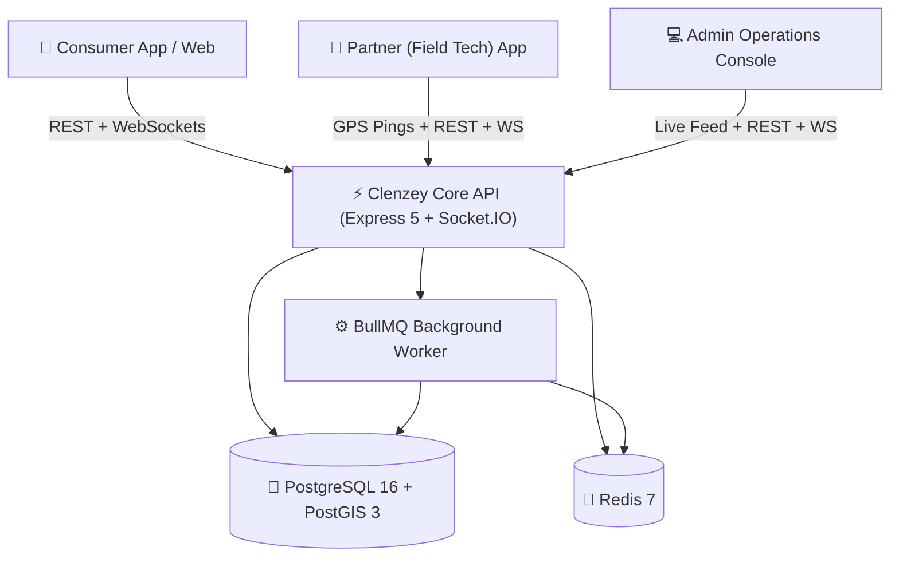
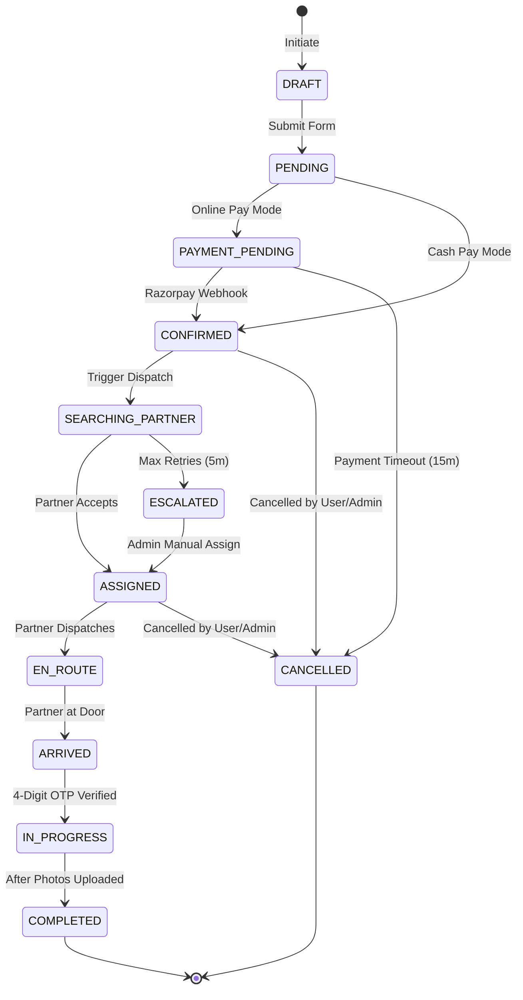

# Clenzey End-to-End App Flow, Screen Inventory, Testing Matrix & Store Launch Blueprint

> **Document Purpose**: Complete architectural map of every screen, button, API hook, user flow, state transition, security edge-case, and step-by-step guide for publishing Clenzey to Apple App Store & Google Play Store with automated CI/CD.

---

## Table of Contents
1. [Platform Architecture & Actor Roles](#1-platform-architecture--actor-roles)
2. [Consumer Flow & Screen Inventory](#2-consumer-flow--screen-inventory)
3. [Partner (Technician) Flow & Screen Inventory](#3-partner-technician-flow--screen-inventory)
4. [Operations Admin Console Flow (16 Modules)](#4-operations-admin-console-flow-16-modules)
5. [State Machines & Background Dispatch Engine](#5-state-machines--background-dispatch-engine)
6. [Comprehensive QA Testing Matrix & Bug-Hunting Scenarios](#6-comprehensive-qa-testing-matrix--bug-hunting-scenarios)
7. [App Store (iOS) & Google Play Store (Android) Submission Guide](#7-app-store-ios--google-play-store-android-submission-guide)
8. [Critical Store Compliance & Avoidance Checklist](#8-critical-store-compliance--avoidance-checklist)
9. [Continuous Integration & Automated Deployment (CI/CD)](#9-continuous-integration--automated-deployment-cicd)

---

## 1. Platform Architecture & Actor Roles



### Actor Personas & Permissions:
1. **`CONSUMER`**: Books services, tracks partner ETA, pays via Razorpay/Cash, provides 4-digit check-in verification code, rates & reviews, raises disputes within 7 days.
2. **`PARTNER`**: Field technician. Undergoes KYC verification, sets weekly availability windows, toggles Online/Offline, receives radial geo-dispatches, enters check-in code, uploads before/after job photos, views payroll slips.
3. **`ADMIN`** (Sub-roles: `OPERATIONS`, `FINANCE`, `SUPER_ADMIN`): Oversees live booking map, manages manual dispatch overrides, draws Leaflet geofence zones, sets zone surge pricing, audits KYC documents, processes partner payouts and monthly payroll runs.
4. **`SYSTEM / WORKER`**: Auto-assigns nearest partners using PostGIS `ST_DWithin`, expands radius every 30s, escalates unassigned jobs, sweeps stale online statuses, processes monthly payroll cron.

---

## 2. Consumer Flow & Screen Inventory

### Screen C1: Splash & Landing / Marketing Page (`clenzey_web`)
- **Location**: `http://localhost:4000/` or Mobile Splash
- **UI Elements & Buttons**:
  - `Hero Section`: "Book Deep Cleaning Now" CTA button $\rightarrow$ opens booking drawer/flow.
  - `Service Category Cards`: Deep Cleaning, Plumbing, Electrical, Commercial Maintenance $\rightarrow$ navigates to category catalog.
  - `Coverage Zone Checker`: Search input for Pincode/Area $\rightarrow$ invokes `GET /api/v1/location/serviceability`.
  - `Waitlist Form`: Full Name, Phone, City, "Join Waitlist" button $\rightarrow$ submits waitlist lead.
  - `Download App Badges`: "App Store" and "Google Play" badges $\rightarrow$ deeplinks to app store listings.
  - `Footer Links`: Privacy Policy (`/privacy`), Terms of Service (`/terms`), Safety Guarantee (`/safety-guarantee`), FAQ (`/faq`).

### Screen C2: Consumer Authentication (Phone OTP / Password)
- **Route / Trigger**: Triggered when initiating booking or profile access.
- **UI Elements & Inputs**:
  - `Phone Number Input`: Standard E.164 phone formatting (`+91`).
  - `Send OTP Button`: Calls Firebase Phone Auth / MSG91 `POST /api/v1/consumers/auth/firebase`.
  - `OTP Input Boxes`: 6-digit numeric input with auto-focus and 60-second resend cooldown timer.
  - `Email / Password Toggle`: Switches to `POST /api/v1/consumers/auth/signin` or `/signup`.
  - `Terms Agreement Checkbox`: "I agree to Terms & Privacy Policy".

### Screen C3: Service Catalog & Scope Questionnaire
- **Route**: `/services` or `/services/:serviceId`
- **UI Elements & Inputs**:
  - `Variant Selector`: 1 BHK, 2 BHK, 3 BHK, Villa, Office Sq.Ft.
  - `Add-On Chips`: Chimney degreasing, Balcony wash, Fridge interior, Sofa shampoo.
  - `Live Price Breakdown Box`: Dynamic update of base price + add-ons.
  - `Instant vs Scheduled Toggle`:
    - *Instant*: Dispatches available partner immediately.
    - *Scheduled*: Date picker + Time slot pills (invokes `GET /api/v1/slots`).
  - `Continue to Address Button`: Calls `POST /api/v1/bookings/preview`.

### Screen C4: Address Selection & Geolocation Pinning
- **Route**: `/checkout/address`
- **UI Elements & Inputs**:
  - `Google Maps / Leaflet Pin Drop`: Drag pin to pinpoint exact doorway location.
  - `Saved Address List`: Home, Work, Other radio cards with "Set as Default" button.
  - `Address Form`: House/Flat No, Landmark, City, Pincode.
  - `Zone Verification Indicator`: Green "Serviceable in your area" or Red "Outside coverage area".

### Screen C5: Booking Checkout & Payment
- **Route**: `/checkout/payment`
- **UI Elements & Inputs**:
  - `Coupon Code Field`: Input box + "Apply" button $\rightarrow$ calls `POST /api/v1/coupons/validate`.
  - `Pricing Summary Accordion`:
    - Base Service Price
    - Add-On Charges
    - Platform Fee (from `GET /api/v1/admin/pricing-settings`)
    - GST (18%)
    - Coupon Discount (-)
    - **Total Payable**
  - `Payment Method Selection`:
    - `Razorpay (UPI / Card / Netbanking)`: Calls `POST /api/v1/payments/orders` $\rightarrow$ launches Razorpay SDK.
    - `Cash on Service`: Sets payment mode to `CASH`.
  - `Confirm & Pay Button`: Creates booking in `PENDING` $\rightarrow$ `PAYMENT_PENDING` $\rightarrow$ `CONFIRMED`.

### Screen C6: Live Booking Tracking & Partner ETA
- **Route**: `/bookings/:bookingId/track`
- **UI Elements & Features**:
  - `Live Status Timeline`: `SEARCHING_PARTNER` $\rightarrow$ `ASSIGNED` $\rightarrow$ `EN_ROUTE` $\rightarrow$ `IN_PROGRESS` $\rightarrow$ `COMPLETED`.
  - `Map View`: Customer marker, real-time partner vehicle marker streaming via Socket.IO room `booking:{id}`.
  - `Partner Profile Card`: Name, photo, aggregate rating (★ 4.8), experience years, masked call button (`POST /api/v1/bookings/:id/call`).
  - `🔒 4-Digit Check-In Code Card`: **"Give this code to your technician on arrival: `4821`"**. Partner must enter this code to begin work.
  - `Cancel Booking Button`: Calls `POST /api/v1/bookings/:id/cancel` (applies cancellation refund policy rules).

### Screen C7: Job Completion, Rating & Dispute
- **Route**: `/bookings/:bookingId/summary`
- **UI Elements & Features**:
  - `Before & After Gallery`: View photos uploaded by technician.
  - `5-Star Rating Picker`: Star selector + comment textarea $\rightarrow$ calls `POST /api/v1/reviews`.
  - `Tip Partner Option`: Optional tip amount added to partner earnings.
  - `Need Help / Dispute Button`: Active for 7 days post-completion $\rightarrow$ opens Dispute Form (`POST /api/v1/disputes`) with photo evidence attachment.

---

## 3. Partner (Technician) Flow & Screen Inventory

### Screen P1: Partner Onboarding & KYC Submission
- **Route**: `/partner/onboarding`
- **UI Elements & Inputs**:
  - `Personal Info`: Full name, DOB, gender, languages spoken, years of experience.
  - `Skill Checkboxes`: Deep Cleaning, Sofa Care, Electrical, Plumbing.
  - `Document Uploaders`:
    - Aadhaar Card (Front/Back)
    - PAN Card
    - Police Verification / Driving License
    - Selfie Photo
    - Direct S3 presigned upload via `POST /api/v1/uploads/presign`.
  - `Bank Account Form`: Account holder name, account number, IFSC code, bank name (`POST /api/v1/partners/bank-details`).
  - `Status Banner`: `PENDING_VERIFICATION` $\rightarrow$ "Your documents are under review by Clenzey Operations".

### Screen P2: Partner Home & Duty Switch
- **Route**: `/partner/dashboard`
- **UI Elements & Features**:
  - `Online / Offline Duty Toggle`:
    - Switch ON $\rightarrow$ begins background GPS location stream (`POST /api/v1/partners/location`) and sets `is_online = true`.
    - Switch OFF $\rightarrow$ stops dispatches.
  - `Today's Summary Card`: Total jobs completed today, today's earnings, current rating.
  - `Upcoming Scheduled Bookings`: List of pre-assigned jobs for the day with time slots and navigation directions.

### Screen P3: Dispatch Proposal Pop-Up (Incoming Job Alert)
- **Trigger**: Server emits WebSocket event `assignment:proposal` with 45-second countdown timer.
- **UI Elements & Features**:
  - `Sound & Haptic Alarm`: Rings loudly until answered.
  - `Job Summary Card`: Service type, address suburb/distance (e.g. "3.2 km away"), estimated duration, payout amount.
  - `Accept Button (Green)`: Calls `POST /api/v1/bookings/assignments/:id/accept` $\rightarrow$ confirms assignment.
  - `Decline Button (Red)`: Calls `POST /api/v1/bookings/assignments/:id/decline` with reason dropdown $\rightarrow$ triggers instant re-dispatch to next partner.

### Screen P4: Active Job Execution & Check-In Verification
- **Route**: `/partner/job/:bookingId`
- **Step 1 - Navigation**: "Tap to open Google Maps" $\rightarrow$ triggers `POST /api/v1/bookings/:id/transition` to `EN_ROUTE`.
- **Step 2 - Arrival**: Partner taps "I have arrived" $\rightarrow$ changes status to `ARRIVED`.
- **Step 3 - Verify Code**:
  - 4-Digit Input Box: Technician asks customer for code and enters it $\rightarrow$ calls `POST /api/v1/bookings/:id/verify-start`.
  - Unlocks job state to `IN_PROGRESS`.
- **Step 4 - Before Photos**: Mandatory upload of at least 1 "Before" photo.
- **Step 5 - After Photos & Complete**: Upload "After" photo $\rightarrow$ tap "Complete Job" $\rightarrow$ triggers `COMPLETED`.

### Screen P5: Partner Earnings, Payroll & Attendance
- **Route**: `/partner/earnings`
- **UI Elements**:
  - `Monthly Salary Slip`: Base pay, present days, absent days, leave balance.
  - `Incentive Breakdown`: Completed job milestones, 5-star rating bonuses, surge incentives.
  - `Payout History Table`: Date, amount, status (`PAID`, `PROCESSING`, `FAILED`), reference UTR number.

---

## 4. Operations Admin Console Flow (16 Modules)

| Dashboard Route | Screen Name | Key UI Elements & Controls | Primary Backend API |
|---|---|---|---|
| **`/overview`** | Ops Command Center | Real-time KPI cards (Today's Bookings, Active Fleet, Live Revenue, Escalated Jobs), 24h booking volume line chart. | `GET /api/v1/admin/kpis`, `/analytics/revenue` |
| **`/dispatch`** | Live Fleet & Geo-Dispatch | Interactive Leaflet map with partner GPS markers (Green: Online, Blue: On-Job, Gray: Offline). Table of unassigned & escalated bookings with "Manual Assign" and "Retry Dispatch" buttons. | `GET /api/v1/admin/partners/operational-status`, `POST /api/v1/admin/dispatch/*` |
| **`/bookings`** | Booking Management | Master data table with filters (Status, Date Range, Category, City). Booking details slide-over with full lifecycle history, customer contact, before/after photos, manual cancellation with custom refund override. | `GET /api/v1/bookings`, `POST /api/v1/bookings/:id/cancel` |
| **`/partners`** | Partner Fleet & KYC | Filter tabs (`PENDING`, `APPROVED`, `SUSPENDED`). KYC audit modal displaying uploaded Aadhaar/PAN image viewer with 1-click "Approve Partner" and "Reject (with reason)" buttons. | `GET /api/v1/admin/partners`, `PATCH /api/v1/admin/kyc/documents/:id` |
| **`/zones`** | Leaflet Zone Polygon Editor | Interactive map editor allowing admins to draw, edit, and drag GeoJSON MultiPolygon service boundaries. Assign service categories and base surge tiers to zones. | `GET /api/v1/admin/zones`, `POST /api/v1/admin/zones` |
| **`/pricing-settings`** | Zone Price Overrides & Platform Fee | Global Platform fee input (₹), GST Rate (%), Subscription discounts (Weekly, Biweekly, Monthly %). Zone-specific pricing override matrix by service variant. | `GET/PUT /api/v1/admin/pricing-settings`, `POST /api/v1/admin/zones/:id/price-overrides` |
| **`/services`** | Service Catalog Manager | Tree view of Categories $\rightarrow$ Services $\rightarrow$ Variants $\rightarrow$ Add-Ons. Modal to add service titles, description, duration (mins), base price, inclusions/exclusions lists. | `GET/POST/PATCH /api/v1/services` |
| **`/slots`** | Capacity & Time Slot Builder | Batch slot generation tool (select service, date range, start/end hours, slot duration, max booking capacity). Capacity editor per slot. | `GET/POST /api/v1/slots`, `PATCH /api/v1/slots/:id/capacity` |
| **`/customers`** | Customer Directory | Searchable list of consumers, total lifetime bookings, total spend, addresses list. "Block Customer" button with reason prompt. | `GET /api/v1/admin/consumers`, `PATCH /api/v1/admin/consumers/:id` |
| **`/coupons`** | Promotional Campaign Manager | Table of active promo codes. "Create Coupon" modal: Code name, Percent vs Flat discount, Min order value, Max discount cap, Validity date picker. | `GET/POST/PATCH /api/v1/coupons` |
| **`/quotations`** | Commercial Inspection Requests | List of inspection/quotation requests for large offices. Admin price estimator input, notes, and status updater (`QUOTED`, `REJECTED`). | `GET/PATCH /api/v1/admin/quotations` |
| **`/payments`** | Transaction Ledger & Refunds | Razorpay transaction log with payment status, order IDs. "Initiate Refund" modal (Full or Partial refund amount with audit reason). | `GET /api/v1/admin/refunds`, `POST /api/v1/admin/refunds` |
| **`/payroll`** | Partner Salary & Incentive Engine | Monthly attendance table (Days present, absent, leaves). Monthly payroll run generator, salary slips download, incentive configuration rules builder. | `GET/POST /api/v1/admin/payroll/*`, `POST /api/v1/admin/incentive-configs` |
| **`/disputes`** | Dispute Resolution Desk | Open disputes ticket queue categorized by `SERVICE_QUALITY`, `DAMAGE`, `PRICING`, `NO_SHOW`. Evidence photo inspector, resolution notes, refund trigger. | `GET/PATCH /api/v1/admin/disputes` |
| **`/reviews`** | Review & Moderation Desk | Public customer review stream, star distribution ratings, search by partner or customer, moderation flags. | `GET /api/v1/admin/reviews` |
| **`/settings`** | System Settings & Access Control | Admin staff user management, role assignment (`OPERATIONS`, `FINANCE`, `SUPER_ADMIN`), API keys inspection. | `GET /api/v1/admin/*` |

---

## 5. State Machines & Background Dispatch Engine

### 1. Booking State Machine



### 2. Auto-Dispatch Radial Matching Algorithm
1. **Initial Search**: When booking is `CONFIRMED`, BullMQ triggers `instantDispatchJob`.
2. **PostGIS Query**: Executes `ST_DWithin` looking for partners where:
   - `is_online = true`
   - `operational_status = 'IDLE'`
   - `approval_status = 'APPROVED'`
   - Distance $\le$ `DISPATCH_INITIAL_RADIUS_M` (5,000 meters / 5 km)
   - Partner possesses required `service_id` skill.
3. **Scoring & Proposal**: Top-ranked partner receives 45-second WebSocket proposal.
4. **Expansion Loop**: If declined or timed out:
   - Expands radius by `DISPATCH_RADIUS_INCREMENT_M` (+2 km) up to `DISPATCH_MAX_RADIUS_M` (15 km).
5. **Escalation**: If no partner accepts within `DISPATCH_ESCALATION_MIN` (5 mins), status changes to `ESCALATED` and alerts Operations on Admin dashboard.

---

## 6. Comprehensive QA Testing Matrix & Bug-Hunting Scenarios

Use this exact test matrix when conducting manual QA or prompting automated AI testers:

| Test ID | Module | Scenario / Bug-Hunting Target | Expected Result | Edge Case / Risk |
|---|---|---|---|---|
| **QA-01** | Auth | Enter invalid 6-digit OTP 3 times consecutively | Show clear error, enforce rate limiting / lockout after 5 attempts. | Prevent brute-force OTP attacks. |
| **QA-02** | Geofence | Drop map pin 50 meters outside active zone boundary polygon | API returns `isServiceable: false` with friendly message "We are coming soon to your area". | Ensure PostGIS `ST_Contains` correctly rejects out-of-boundary coordinates. |
| **QA-03** | Pricing | Apply coupon code `SAVE50` on order value lower than `minOrderValue` | Rejects coupon with message "Minimum order value of ₹X required". | Prevent negative order totals or zero platform fee bugs. |
| **QA-04** | Booking | Attempt to cancel booking when partner is already `IN_PROGRESS` | Customer cancellation blocked or full cancellation fee deducted as per policy. | State machine constraint test. |
| **QA-05** | Check-In | Partner enters incorrect 4-digit start code | Rejects transition with `400 Bad Request: Invalid check-in verification code`. | Partner cannot start work without customer present. |
| **QA-06** | Concurrency | 2 partners simultaneously tap "Accept" on same proposal | First partner succeeds; second receives `409 Conflict: Assignment already taken`. | Database row-level locking (`SELECT FOR UPDATE`) verification. |
| **QA-07** | Payments | Customer closes Razorpay modal midway through payment | Booking remains in `PAYMENT_PENDING` for 15 mins then transitions to `CANCELLED`. | No orphan confirmed bookings without payment capture. |
| **QA-08** | Offline GPS | Partner goes into elevator / loses internet while `EN_ROUTE` | Socket.IO detects disconnect; background worker marks location stale after 5m without crashing. | Network drop resilience. |
| **QA-09** | KYC Audit | Admin clicks "Reject" without typing a rejection reason | Form validation blocks rejection; requires non-empty reason string. | Partner receives actionable feedback for re-uploading. |
| **QA-10** | Disputes | Customer raises dispute 8 days after job completion | API rejects with `400 Bad Request: Disputes can only be raised within 7 days of completion`. | Enforce dispute window boundaries. |

---

## 7. App Store (iOS) & Google Play Store (Android) Submission Guide

### Step 1: Developer Accounts Prerequisites
- **Apple Developer Program**: Enroll organization at [developer.apple.com](https://developer.apple.com/) ($99/year). Requires D-U-N-S Number for business entity.
- **Google Play Console**: Create developer account at [play.google.com/console](https://play.google.com/console) ($25 one-time fee). Complete Identity & Business Verification.

### Step 2: Store Assets Preparation Matrix

| Asset Type | iOS App Store Requirements | Google Play Store Requirements |
|---|---|---|
| **App Icon** | 1024 x 1024 px PNG (No alpha/transparency, square) | 512 x 512 px PNG (32-bit, max 1MB) |
| **Feature Graphic** | Not applicable | 1024 x 500 px JPG/PNG (Crucial for Play Store header) |
| **Screenshots (Phone)** | 6.7" (1290 x 2796 px) and 6.5" (1242 x 2688 px) — Min 3, Max 10 | Min 4 screenshots, 1080 x 1920 px or 16:9 / 9:16 aspect ratio |
| **Privacy Policy URL** | Live public URL (e.g. `https://clenzey.com/privacy`) | Live public URL matching Play Console data safety form |
| **Terms of Service** | Live public URL (e.g. `https://clenzey.com/terms`) | Required for terms & dispute transparency |
| **Support URL / Email** | Support email + URL (e.g. `https://clenzey.com/faq`) | Public contact email in store listing |

### Step 3: Apple App Store Connect Configuration
1. **Create New App**: Go to App Store Connect $\rightarrow$ Apps $\rightarrow$ Click `+` $\rightarrow$ Select Primary Language, Bundle ID (`com.clenzey.app`), SKU.
2. **App Privacy Details (Privacy Nutrition Label)**:
   - *Location*: "Precise Location" collected for App Functionality (Matching & ETA tracking).
   - *Contact Info*: Name, Phone number for Account Management & Dispatch.
   - *Financial Info*: Payment info collected for purchase processing (handled securely via Razorpay).
   - *User Content*: Photos for KYC & Before/After job verification.
3. **App Review Demo Credentials**:
   - Provide dedicated test credentials in "App Review Information":
     - `Phone`: `+91 9999999999`
     - `Test OTP`: `123456`
     - `Notes for Reviewer`: "Step 1: Log in with test phone. Step 2: Select 'Deep Cleaning'. Step 3: Use mock address provided in profile. Use Razorpay Test UPI ID `success@razorpay` to complete test payment."

### Step 4: Google Play Console Configuration
1. **Target Audience & Content Rating**: Complete Content Rating Questionnaire (Rated 3+ / Everyone).
2. **Data Safety Form**:
   - Disclose data collection: Location (Approximate & Precise), Personal Info (Name, Phone), Photos (Optional/Required for job verification), Financial (Transaction history).
   - Confirm data is encrypted in transit (HTTPS / TLS 1.3).
   - Confirm users can request account & data deletion.
3. **Target Android Version**: Ensure `targetSdkVersion` $\ge 35$ (Android 15 requirement).

---

## 8. Critical Store Compliance & Avoidance Checklist

### 🚨 Top 10 Rejection Traps & How Clenzey Complies:

1. **Account Deletion Requirement (Apple 5.1.1(v) & Google Play)**:
   - *Requirement*: Must allow users to initiate account deletion directly inside the app.
   - *Clenzey Implementation*: `DELETE /api/v1/consumers/me` route exists in backend. Must have a visible **"Delete My Account"** button inside Profile Settings with confirmation dialog.
2. **Physical Services vs In-App Purchases (Apple 3.1.5(a))**:
   - *Rule*: Physical services consumed outside the digital app (cleaning, plumbing, home maintenance) **MUST NOT** use Apple In-App Purchases (30% fee). They must use external gateways (Razorpay/Stripe/Cards).
   - *Compliance*: Using Razorpay SDK is 100% compliant with Apple guidelines for physical on-demand services.
3. **Background Location Disclosure (Partner App Only)**:
   - *Rule*: Apple & Google strictly reject apps requesting background GPS unless clearly explained.
   - *Compliance*:
     - Android: Must display **Prominent In-App Disclosure Dialog** before requesting `ACCESS_BACKGROUND_LOCATION`: *"Clenzey Partner collects location data to enable customer ETA tracking and job matching even when the app is closed or not in use."*
     - iOS: Add clear strings in `Info.plist`:
       - `NSLocationWhenInUseUsageDescription`: *"Clenzey needs your location to find nearby services and calculate travel time."*
       - `NSLocationAlwaysAndWhenInUseUsageDescription`: *"Clenzey Partner needs background location to broadcast your ETA to customers during active jobs."*
4. **App Completeness (Apple 2.1)**:
   - Avoid placeholder text ("Lorem Ipsum"), broken buttons, empty lists, or test URLs in release builds.
5. **Masked Calling & Microphone Permissions**:
   - When integrating Exotel/Twilio masked calling, declare `NSMicrophoneUsageDescription` only if making in-app VoIP calls. If using native telephone dialer links (`tel:+91...`), no microphone permission needed.
6. **Hardcoded Secrets**:
   - Never bundle JWT secrets, Razorpay secret keys, or AWS private keys in mobile client binaries. All sensitive API calls must go through backend endpoints.
7. **IPv6 Network Compatibility**:
   - Apple review tests apps on strict IPv6-only networks. Backend hostnames must support IPv6 DNS resolution.
8. **Clear Cancellation & Refund Terms**:
   - Display refund policies transparently before the final payment button to comply with consumer protection regulations.

---

## 9. Continuous Integration & Automated Deployment (CI/CD)

### Production Deployment Architecture
- **Backend API & BullMQ Worker**: Containerized Docker image hosted on AWS ECS / DigitalOcean / Render with Auto-Scaling.
- **Admin Console & Web Portal**: Deployed on Vercel / AWS Amplify / Cloudflare Pages.
- **Mobile Apps (iOS & Android)**: Automated builds via **GitHub Actions** + **Fastlane**.

### 1. Automated GitHub Actions Workflow (`.github/workflows/ci.yml`)

```yaml
name: Clenzey CI/CD Pipeline

on:
  push:
    branches: [main, staging]
  pull_request:
    branches: [main]

jobs:
  backend-test:
    name: Backend Test & Typecheck
    runs-on: ubuntu-latest
    steps:
      - uses: actions/checkout@v4
      - uses: pnpm/action-setup@v3
        with:
          version: 10
      - uses: actions/setup-node@v4
        with:
          node-version: 24
          cache: 'pnpm'
          cache-dependency-path: 'clenzey_backend-main/pnpm-lock.yaml'

      - name: Install Dependencies
        run: cd clenzey_backend-main && pnpm install

      - name: Run Linter & Typecheck
        run: |
          cd clenzey_backend-main
          pnpm lint
          pnpm type-check

      - name: Run Test Suite
        run: |
          cd clenzey_backend-main
          pnpm test:run

  admin-test:
    name: Admin Dashboard Build Check
    runs-on: ubuntu-latest
    steps:
      - uses: actions/checkout@v4
      - uses: pnpm/action-setup@v3
        with:
          version: 10
      - uses: actions/setup-node@v4
        with:
          node-version: 22
          cache: 'pnpm'
          cache-dependency-path: 'clenzey_admin-main/pnpm-lock.yaml'

      - name: Install & Build Admin
        run: |
          cd clenzey_admin-main
          pnpm install
          pnpm build
```

### 2. Fastlane Mobile Deployment Setup (`Fastfile`)

```ruby
# fastlane/Fastfile for automated Store deployment

default_platform(:ios)

platform :ios do
  desc "Push new build to TestFlight"
  lane :beta do
    increment_build_number(xcodeproj: "ios/Clenzey.xcodeproj")
    build_app(workspace: "ios/Clenzey.xcworkspace", scheme: "Clenzey")
    upload_to_testflight(
      api_key_path: "fastlane/app_store_connect_key.json",
      skip_waiting_for_build_processing: true
    )
  end

  desc "Deploy new App Store Release"
  lane :release do
    build_app(workspace: "ios/Clenzey.xcworkspace", scheme: "Clenzey")
    upload_to_app_store(
      api_key_path: "fastlane/app_store_connect_key.json",
      force: true,
      submit_for_review: false
    )
  end
end

platform :android do
  desc "Build and upload Android AAB to Google Play Internal Track"
  lane :internal do
    gradle(task: "bundleRelease", project_dir: "android/")
    upload_to_play_store(
      track: "internal",
      json_key: "fastlane/google_play_service_account.json",
      package_name: "com.clenzey.app"
    )
  end

  desc "Promote Internal to Production Release"
  lane :promote_to_production do
    upload_to_play_store(
      track: "internal",
      track_promote_to: "production",
      json_key: "fastlane/google_play_service_account.json",
      package_name: "com.clenzey.app"
    )
  end
end
```

---

## 10. Summary Checklist Before Production Launch

- [ ] **Database**: Run all Drizzle migrations (`pnpm db:dev:migrate` or `drizzle-kit migrate`) and ensure PostGIS is enabled on prod DB.
- [ ] **Seed Catalog**: Run `pnpm seed:prod` to populate standard cleaning, plumbing, electrical services & default pricing tiers.
- [ ] **Admin Account**: Run `pnpm admin:add:prod` to create initial super-admin credentials for dashboard access.
- [ ] **SSL / HTTPS**: Enforce TLS 1.3 on custom domain for API and WebSocket connections.
- [ ] **CORS**: Set `CORS_ORIGINS` to exact production frontend domains in production environment.
- [ ] **App Store Testing Account**: Create active consumer and partner test accounts in DB with known OTP bypass or verified test phone numbers.
- [ ] **Store Review Notes**: Submit clear step-by-step review instructions and demo video links in App Store Connect & Play Console review forms.
