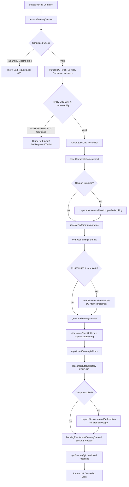
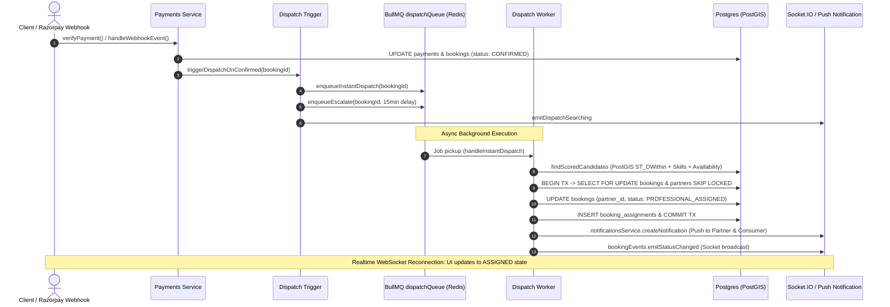

# Backend Execution Path: `POST /api/v1/bookings` (Create Booking)

Complete end-to-end backend execution trace for the booking creation and auto-dispatch pipeline in [`clenzey_backend`](file:///c:/Users/vrund/OneDrive/Desktop/clenzey/clenzey_backend-main).

---

## 1. Global Middleware Stack (Execution Order)

Request enters [`createServer`](file:///c:/Users/vrund/OneDrive/Desktop/clenzey/clenzey_backend-main/src/server.ts#L16-L62) in [`src/server.ts`](file:///c:/Users/vrund/OneDrive/Desktop/clenzey/clenzey_backend-main/src/server.ts):

1. **`helmet`** ([`server.ts:22`](file:///c:/Users/vrund/OneDrive/Desktop/clenzey/clenzey_backend-main/src/server.ts#L22)): Sets security headers (`Cross-Origin-Resource-Policy: cross-origin`, HSTS if `NODE_ENV === 'prod'`).
2. **`cors`** ([`server.ts:32`](file:///c:/Users/vrund/OneDrive/Desktop/clenzey/clenzey_backend-main/src/server.ts#L32)): Validates request origin against allowed list via [`isAllowedCorsOrigin`](file:///c:/Users/vrund/OneDrive/Desktop/clenzey/clenzey_backend-main/src/configs/corsConfig.ts).
3. **`apiReqestlimiter`** ([`rateLimiterMiddleware.ts:12`](file:///c:/Users/vrund/OneDrive/Desktop/clenzey/clenzey_backend-main/src/middlewares/rateLimiterMiddleware.ts#L12)): IP-based rate limiting using Redis store (in-memory fallback). Throws `429 Too Many Requests` on breach.
4. **`express.json`** ([`server.ts:45`](file:///c:/Users/vrund/OneDrive/Desktop/clenzey/clenzey_backend-main/src/server.ts#L45)): Parses JSON body (1MB limit). Attaches raw Buffer to `req.rawBody` for webhook HMAC verification.
5. **`express.urlencoded`** ([`server.ts:52`](file:///c:/Users/vrund/OneDrive/Desktop/clenzey/clenzey_backend-main/src/server.ts#L52)): Parses URL-encoded payloads with 1MB limit.
6. **`cookieParser`** ([`server.ts:53`](file:///c:/Users/vrund/OneDrive/Desktop/clenzey/clenzey_backend-main/src/server.ts#L53)): Parses incoming cookie headers into `req.cookies`.
7. **`requestIdMiddleware`** ([`requestIdMiddleware.ts:6`](file:///c:/Users/vrund/OneDrive/Desktop/clenzey/clenzey_backend-main/src/middlewares/requestIdMiddleware.ts#L6)): Attaches `x-request-id` header (or generates nanoid) for distributed tracing.
8. **`requestLogger`** ([`reqLoggerMiddleware.ts:15`](file:///c:/Users/vrund/OneDrive/Desktop/clenzey/clenzey_backend-main/src/middlewares/reqLoggerMiddleware.ts#L15)): Winston logger recording HTTP method, path, IP, user-agent, and status codes.
9. **`compression`** ([`server.ts:56`](file:///c:/Users/vrund/OneDrive/Desktop/clenzey/clenzey_backend-main/src/server.ts#L56)): Response gzip / deflate / brotli compression.
10. **Router Mounting**: Routes routed from [`app.use("/api/v1", v1)`](file:///c:/Users/vrund/OneDrive/Desktop/clenzey/clenzey_backend-main/src/server.ts#L58) $\rightarrow$ [`v1.use("/bookings", bookingsRoutes)`](file:///c:/Users/vrund/OneDrive/Desktop/clenzey/clenzey_backend-main/src/api/v1/index.ts#L52).

---

## 2. Route Definition & Route-Level Middlewares

Route definition in [`src/api/v1/bookings/routes.ts`](file:///c:/Users/vrund/OneDrive/Desktop/clenzey/clenzey_backend-main/src/api/v1/bookings/routes.ts#L80-L84):
```typescript
bookingsRoutes.post(
  "/",
  [requireAuth(["CONSUMER"]), bookingsValidation.createBookingRequest],
  bookingsController.createBooking,
);
```

### Step 1: Authentication Middleware
- **Function**: [`requireAuth(["CONSUMER"])`](file:///c:/Users/vrund/OneDrive/Desktop/clenzey/clenzey_backend-main/src/middlewares/authMiddleware.ts#L15)
- **File**: [`src/middlewares/authMiddleware.ts`](file:///c:/Users/vrund/OneDrive/Desktop/clenzey/clenzey_backend-main/src/middlewares/authMiddleware.ts)
- **Logic & Branch Conditions**:
  - `!req.headers.authorization?.match(/^Bearer\s+(.+)$/i)` $\rightarrow$ throws `UnauthorizedError("Missing or invalid authorization header.")` (`401`).
  - Calls `verifyToken(token)` via `jose` library:
    - If expired $\rightarrow$ throws `UnauthorizedError("Session expired, please log in again.")` (`401`).
    - If signature invalid $\rightarrow$ throws `UnauthorizedError("Invalid token.")` (`401`).
  - `payload.userType !== "CONSUMER"` $\rightarrow$ throws `UnauthorizedError("Access denied.")` (`401`).
  - Sets `req.user = payload` (`sub`, `userType`, `phone`). Calls `next()`.

### Step 2: Request Validation Middleware
- **Function**: [`createBookingRequest`](file:///c:/Users/vrund/OneDrive/Desktop/clenzey/clenzey_backend-main/src/api/v1/bookings/validations.ts#L145)
- **File**: [`src/api/v1/bookings/validations.ts`](file:///c:/Users/vrund/OneDrive/Desktop/clenzey/clenzey_backend-main/src/api/v1/bookings/validations.ts)
- **Logic & Branch Conditions**:
  - Runs Zod `safeParse` against schema `createBookingDto`:
    - `serviceId`: UUID (required)
    - `variantId`: UUID (required)
    - `addressId`: UUID (required)
    - `bookingType`: `"INSTANT" | "SCHEDULED"` (required)
    - `addonIds`: UUID array (defaults to `[]`)
    - `subscriptionPlan`: `"ONE_TIME" | "DAILY" | "WEEKLY" | "FORTNIGHTLY" | "MONTHLY" | "CUSTOM"` (defaults to `"ONE_TIME"`)
    - `paymentMode`: `"RAZORPAY" | "CASH" | "WALLET"` (optional)
    - `scheduledAt`: ISO 8601 datetime (optional)
    - `timeSlotId`: UUID (optional)
    - `corporateDetails`: Nested DTO (optional)
    - `largeOfficeScope`: Nested scope DTO (optional)
  - **Refinement Gate**: `bookingType === "SCHEDULED" && !scheduledAt && !timeSlotId` $\rightarrow$ validation fails.
  - If validation fails $\rightarrow$ throws [`RequestValidationError`](file:///c:/Users/vrund/OneDrive/Desktop/clenzey/clenzey_backend-main/src/errors/appErrors.ts) (`422 Unprocessable Entity`) with formatted field issues.
  - If valid $\rightarrow$ replaces `req.body` with parsed data, calls `next()`.

---

## 3. Controller Execution

- **Function**: [`createBooking`](file:///c:/Users/vrund/OneDrive/Desktop/clenzey/clenzey_backend-main/src/api/v1/bookings/controllers.ts#L29-L42)
- **File**: [`src/api/v1/bookings/controllers.ts`](file:///c:/Users/vrund/OneDrive/Desktop/clenzey/clenzey_backend-main/src/api/v1/bookings/controllers.ts)
- **Logic**:
  - Wrapped by [`tryCatchUtil`](file:///c:/Users/vrund/OneDrive/Desktop/clenzey/clenzey_backend-main/src/utilities/commonUtils.ts) which passes unhandled errors to global `errorHandlerMiddleware`.
  - Reads `consumerId = req.user?.sub`.
  - If `!consumerId` $\rightarrow$ throws `UnauthorizedError()` (`401`).
  - Calls `bookingsService.createBooking({ ...req.body, consumerId })`.
  - Sends HTTP 201 via [`sendResponse(res, { data: { booking }, statusCode: HttpStatusCode.Created })`](file:///c:/Users/vrund/OneDrive/Desktop/clenzey/clenzey_backend-main/src/utilities/commonUtils.ts).

---

## 4. Service Flow: `bookingsService.createBooking`

- **Function**: [`createBooking`](file:///c:/Users/vrund/OneDrive/Desktop/clenzey/clenzey_backend-main/src/api/v1/bookings/service.ts#L497-L683)
- **File**: [`src/api/v1/bookings/service.ts`](file:///c:/Users/vrund/OneDrive/Desktop/clenzey/clenzey_backend-main/src/api/v1/bookings/service.ts)



### Detailed Execution Steps:

#### A. Input Pre-check
- Condition: `input.largeOfficeScope && (input.subscriptionPlan ?? "ONE_TIME") !== input.largeOfficeScope.cleaningFrequency` $\rightarrow$ throws `BadRequestError("Cleaning frequency must match the selected subscription plan.")` (`400`).

#### B. Context Resolution: [`resolveBookingContext`](file:///c:/Users/vrund/OneDrive/Desktop/clenzey/clenzey_backend-main/src/api/v1/bookings/service.ts#L150-L338)
1. **Schedule Time Gate**:
   - `input.bookingType === "SCHEDULED" && !input.scheduledAt` $\rightarrow$ throws `BadRequestError` (`400`).
   - `input.bookingType === "SCHEDULED" && new Date(input.scheduledAt).getTime() <= Date.now()` $\rightarrow$ throws `BadRequestError("scheduledAt must be in the future.")` (`400`).
2. **Parallel Entity Fetch (Database)**:
   - `servicesRepo.findServiceById(input.serviceId)` $\rightarrow$ `SELECT * FROM services WHERE id = $1`
   - `repo.findConsumerProfileById(input.consumerId)` $\rightarrow$ `SELECT * FROM consumers WHERE id = $1`
   - `repo.findAddressById(input.addressId)` $\rightarrow$ `SELECT * FROM addresses WHERE id = $1`
3. **Integrity Checks**:
   - `!service` $\rightarrow$ throws `NotFoundError("Service not found.")` (`404`).
   - `!service.variants.find(v => v.id === input.variantId)` $\rightarrow$ throws `BadRequestError("Invalid variant for this service.")` (`400`).
   - `input.largeOfficeScope && (service.category !== 'CORPORATE' || variant.value !== 'emp_100_plus' || variant.pricingModel !== 'INSPECTION')` $\rightarrow$ throws `BadRequestError` (`400`).
   - `!consumer` $\rightarrow$ throws `NotFoundError("Consumer not found.")` (`404`).
   - `!address || address.consumerId !== input.consumerId` $\rightarrow$ throws `BadRequestError("Invalid address for this consumer.")` (`400`).
   - `address.deletedAt !== null` $\rightarrow$ throws `BadRequestError("This address has been deleted. Pick another.")` (`400`).
4. **PostGIS Serviceability Check**:
   - Condition: `address.latitude != null && address.longitude != null`:
     - Calls [`zonesService.checkServiceability(lat, lng, serviceId)`](file:///c:/Users/vrund/OneDrive/Desktop/clenzey/clenzey_backend-main/src/api/v1/zones/service.ts).
     - Executes PostGIS query: `ST_Contains(zones.polygon, ST_SetSRID(ST_Point(lng, lat), 4326)) WHERE service_id = $1 AND is_active = true`.
     - `!decision.isServiceable` $\rightarrow$ throws `BadRequestError(decision.reason)` (`400`).
   - Fallback condition: `!address.isServiceable` $\rightarrow$ throws `BadRequestError("This address isn't serviceable.")` (`400`).
5. **Add-on Filtering**:
   - Verifies `input.addonIds` against `service.addons`. Mismatch $\rightarrow$ throws `BadRequestError("One or more add-ons are invalid for this service.")` (`400`).
6. **Variant Base Price Calculation**:
   - Sub-variant selection or large office calculation ([`computeLargeOfficeBasePrice`](file:///c:/Users/vrund/OneDrive/Desktop/clenzey/clenzey_backend-main/src/api/v1/services/largeOfficePricing.ts)).
   - Default: `basePrice = parseMoney(variant.discountedPrice ?? variant.basePrice)`.
7. **Zone Dynamic Price Override**:
   - If coordinates present $\rightarrow$ calls [`zonePricingService.resolveBasePrice(serviceId, variantId, lat, lng)`](file:///c:/Users/vrund/OneDrive/Desktop/clenzey/clenzey_backend-main/src/api/v1/zones/pricingService.ts) (PostGIS polygon match).
   - If `resolved.isOverride` $\rightarrow$ overrides `basePrice`. Wrapped in `try/catch` with graceful catalog fallback.
8. **Base Price Integrity**:
   - `!Number.isFinite(basePrice) || basePrice <= 0` $\rightarrow$ throws `BadRequestError` (`400`).

#### C. Corporate Validation
- Function: [`assertCorporateBookingInput(...)`](file:///c:/Users/vrund/OneDrive/Desktop/clenzey/clenzey_backend-main/src/api/v1/bookings/service.ts#L469-L495).
- If `serviceCategory !== "CORPORATE"` and `corporateDetails` given $\rightarrow$ throws `BadRequestError` (`400`).
- If `serviceCategory === "CORPORATE"` and `!corporateDetails` given $\rightarrow$ throws `BadRequestError` (`400`).

#### D. Coupon Validation
- Condition: `if (input.couponCode)`:
  - Calls [`couponsService.validateCouponForBooking(...)`](file:///c:/Users/vrund/OneDrive/Desktop/clenzey/clenzey_backend-main/src/api/v1/coupons/service.ts).
  - DB checks: coupon expiry, usage counts, minimum spend, category restrictions.
  - Invalid coupon $\rightarrow$ throws `BadRequestError` (`400`).
  - Sets `appliedCoupon = { code, couponId, discount }`.

#### E. Platform Pricing Engine
- Calls [`resolvePlatformPricingRates()`](file:///c:/Users/vrund/OneDrive/Desktop/clenzey/clenzey_backend-main/src/api/v1/platformPricing/service.ts) to fetch tax rate and platform fee.
- Calls [`computePricing(...)`](file:///c:/Users/vrund/OneDrive/Desktop/clenzey/clenzey_backend-main/src/api/v1/bookings/pricing.ts#L100).
- Calls [`assertValidPricingBreakdown(breakdown)`](file:///c:/Users/vrund/OneDrive/Desktop/clenzey/clenzey_backend-main/src/api/v1/bookings/service.ts#L137) (`totalAmount <= 0` $\rightarrow$ throws `BadRequestError` `400`).

#### F. Slot Reservation (Scheduled Bookings)
- Condition: `if (input.bookingType === "SCHEDULED" && input.timeSlotId)`:
  - Calls [`slotsService.tryReserveSlot(input.timeSlotId)`](file:///c:/Users/vrund/OneDrive/Desktop/clenzey/clenzey_backend-main/src/api/v1/slots/service.ts).
  - DB Query: `UPDATE time_slots SET current_bookings = current_bookings + 1 WHERE id = $1 AND current_bookings < max_capacity RETURNING *`.
  - If capacity full $\rightarrow$ throws `BadRequestError("This time slot is no longer available.")` (`400`).
  - If service mismatch $\rightarrow$ calls `slotsService.releaseSlot(id)` and throws `BadRequestError` (`400`).

#### G. Database Insertion & Transaction Integrity
- Generates booking number: [`repo.generateBookingNumber()`](file:///c:/Users/vrund/OneDrive/Desktop/clenzey/clenzey_backend-main/src/api/v1/bookings/repository.ts#L70).
- Calls [`withUniqueCheckInCode(...)`](file:///c:/Users/vrund/OneDrive/Desktop/clenzey/clenzey_backend-main/src/api/v1/bookings/checkInCode.ts#L10) $\rightarrow$ generates 4-digit code, inserts record:
  - DB Query: [`repo.insertBooking({...})`](file:///c:/Users/vrund/OneDrive/Desktop/clenzey/clenzey_backend-main/src/api/v1/bookings/repository.ts#L85) $\rightarrow$ `INSERT INTO bookings (...) VALUES (...) RETURNING *` (status: `"PENDING"`).
- `try/catch` block: If `insertBooking` fails and `reservedSlotId` is present $\rightarrow$ calls `slotsService.releaseSlot(reservedSlotId)` to avoid slot leaks.
- DB Query: [`repo.insertBookingAddons(...)`](file:///c:/Users/vrund/OneDrive/Desktop/clenzey/clenzey_backend-main/src/api/v1/bookings/repository.ts#L130) $\rightarrow$ `INSERT INTO booking_addons (...) VALUES (...)`.
- DB Query: [`repo.insertStatusHistory(...)`](file:///c:/Users/vrund/OneDrive/Desktop/clenzey/clenzey_backend-main/src/api/v1/bookings/repository.ts#L150) $\rightarrow$ `INSERT INTO booking_status_history (...)`.
- Condition: `if (appliedCoupon)`:
  - DB Query: `couponsService.recordRedemption(...)` $\rightarrow$ `INSERT INTO coupon_redemptions (...)`.
  - DB Query: `couponsService.incrementUsage(...)` $\rightarrow$ `UPDATE coupons SET times_used = times_used + 1 WHERE id = $1`.

#### H. Realtime Event Emission
- Calls [`bookingEvents.emitBookingCreated(...)`](file:///c:/Users/vrund/OneDrive/Desktop/clenzey/clenzey_backend-main/src/realtime/bookingEvents.ts#L75):
  - Emits in-process event `"booking:created"`.
  - [`socketServer`](file:///c:/Users/vrund/OneDrive/Desktop/clenzey/clenzey_backend-main/src/realtime/socketServer.ts) broadcasts event to room `consumer:${booking.consumerId}` and `admin_feed`.

#### I. Response Hydration & Data Sanitization
- Calls [`getBookingById(booking.id, { actorType: "CONSUMER", userId: consumerId })`](file:///c:/Users/vrund/OneDrive/Desktop/clenzey/clenzey_backend-main/src/api/v1/bookings/service.ts#L687):
  - Runs parallel DB queries for `addons`, `statusHistory`, `reviews`, `disputes`, and `address`.
  - Calls [`sanitizeBookingCheckInCode(...)`](file:///c:/Users/vrund/OneDrive/Desktop/clenzey/clenzey_backend-main/src/api/v1/bookings/sanitizeBooking.ts) to enforce actor-based field masking.
- Returns hydrated JSON object to controller.
- Client receives HTTP 201 Created with JSON response.

---

## 5. Async / Background Processing & State Reconnection

Once the booking reaches `"CONFIRMED"` status (via payment capture in [`payments/service.ts`](file:///c:/Users/vrund/OneDrive/Desktop/clenzey/clenzey_backend-main/src/api/v1/payments/service.ts#L152) or webhook), async dispatch pipeline executes:



### Async Dispatch Step Breakdown:
1. **Triggering Dispatch**:
   - Function: [`triggerDispatchOnConfirmed`](file:///c:/Users/vrund/OneDrive/Desktop/clenzey/clenzey_backend-main/src/queues/dispatchTrigger.ts#L19).
   - If Redis available $\rightarrow$ calls `enqueueInstantDispatch(bookingId)` and `enqueueEscalate(bookingId, 15m)`.
   - If Redis offline $\rightarrow$ falls back to synchronous execution `processInstantDispatch(bookingId)`.
2. **BullMQ Queue**:
   - Queue: `dispatch` in [`src/queues/dispatchQueue.ts`](file:///c:/Users/vrund/OneDrive/Desktop/clenzey/clenzey_backend-main/src/queues/dispatchQueue.ts).
3. **Background Worker Processor**:
   - Handler: [`handleInstantDispatch`](file:///c:/Users/vrund/OneDrive/Desktop/clenzey/clenzey_backend-main/src/workers/dispatchHandlers.ts#L27).
   - Calls [`autoAssignPartner`](file:///c:/Users/vrund/OneDrive/Desktop/clenzey/clenzey_backend-main/src/api/v1/bookings/dispatchService.ts#L52):
     - Spatial matching via PostGIS: [`findScoredCandidates`](file:///c:/Users/vrund/OneDrive/Desktop/clenzey/clenzey_backend-main/src/api/v1/bookings/assignmentEngine.ts#L125) (`ST_DWithin(partners.location, ST_SetSRID(ST_Point(lng, lat), 4326), radiusMeters)`, skill verification, KYC approved check, active shift filter).
     - Row Locking: `SELECT id, partner_id, status FROM bookings WHERE id = $1 FOR UPDATE`.
     - Partner Lock: `SELECT id FROM partners WHERE id = $1 FOR UPDATE SKIP LOCKED`.
     - Updates booking: `UPDATE bookings SET partner_id = $1, partner_assigned_at = now()`.
     - Inserts record into `booking_assignments` table with status `ACCEPTED`.
4. **Push Notification & Realtime Reconnection**:
   - Calls [`notificationsService.createNotification`](file:///c:/Users/vrund/OneDrive/Desktop/clenzey/clenzey_backend-main/src/api/v1/notifications/service.ts) (FCM push notification to partner & consumer).
   - Calls `bookingEvents.emitStatusChanged(...)` $\rightarrow$ broadcasts over Socket.IO room `consumer:${booking.consumerId}` with `{ toStatus: "PROFESSIONAL_ASSIGNED", partnerId, etaMinutes }`.
   - Consumer frontend receives WebSocket event, clears searching animation, and renders assigned partner card and live GPS map tracking.

---

## 6. Error Handling & Branch Summary

| Execution Step | Condition / Error Trigger | Handled By | Result / HTTP Code |
| :--- | :--- | :--- | :--- |
| Global Rate Limit | Request count > 100/min per IP | [`rateLimiterMiddleware.ts`](file:///c:/Users/vrund/OneDrive/Desktop/clenzey/clenzey_backend-main/src/middlewares/rateLimiterMiddleware.ts) | `429 Too Many Requests` |
| Auth Header | Missing or non-Bearer header | [`authMiddleware.ts`](file:///c:/Users/vrund/OneDrive/Desktop/clenzey/clenzey_backend-main/src/middlewares/authMiddleware.ts) | `401 Unauthorized` |
| JWT Verification | Expired token or invalid signature | [`authMiddleware.ts`](file:///c:/Users/vrund/OneDrive/Desktop/clenzey/clenzey_backend-main/src/middlewares/authMiddleware.ts) | `401 Unauthorized` |
| Role Check | `userType !== "CONSUMER"` | [`authMiddleware.ts`](file:///c:/Users/vrund/OneDrive/Desktop/clenzey/clenzey_backend-main/src/middlewares/authMiddleware.ts) | `401 Unauthorized` |
| Schema Validation | Invalid UUID, missing fields, past datetime for scheduled | [`validations.ts`](file:///c:/Users/vrund/OneDrive/Desktop/clenzey/clenzey_backend-main/src/api/v1/bookings/validations.ts) | `422 Unprocessable Entity` |
| Service Lookup | `serviceId` not found in DB | [`service.ts`](file:///c:/Users/vrund/OneDrive/Desktop/clenzey/clenzey_backend-main/src/api/v1/bookings/service.ts) | `404 Not Found` |
| Address Ownership | Address does not belong to user or is soft-deleted | [`service.ts`](file:///c:/Users/vrund/OneDrive/Desktop/clenzey/clenzey_backend-main/src/api/v1/bookings/service.ts) | `400 Bad Request` |
| Geofence Check | Coordinates outside active polygon in PostGIS `zones` | [`zones/service.ts`](file:///c:/Users/vrund/OneDrive/Desktop/clenzey/clenzey_backend-main/src/api/v1/zones/service.ts) | `400 Bad Request` |
| Addon Verification | Selected add-on ID not linked to service catalog | [`service.ts`](file:///c:/Users/vrund/OneDrive/Desktop/clenzey/clenzey_backend-main/src/api/v1/bookings/service.ts) | `400 Bad Request` |
| Slot Reservation | `timeSlotId` full capacity (`current_bookings >= max_capacity`) | [`slots/service.ts`](file:///c:/Users/vrund/OneDrive/Desktop/clenzey/clenzey_backend-main/src/api/v1/slots/service.ts) | `400 Bad Request` |
| Coupon Validation | Coupon expired, usage limit reached, or min spend not met | [`coupons/service.ts`](file:///c:/Users/vrund/OneDrive/Desktop/clenzey/clenzey_backend-main/src/api/v1/coupons/service.ts) | `400 Bad Request` |
| DB Insert Failure | Connection failure or SQL constraint violation | [`errorHandlerMiddleware.ts`](file:///c:/Users/vrund/OneDrive/Desktop/clenzey/clenzey_backend-main/src/middlewares/errorHandlerMiddleware.ts) | Releases slot, returns `500 Internal Server Error` |
