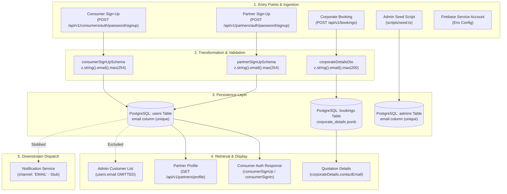

# Email & User Identity Data Flow Architecture

Complete end-to-end trace of email address and user identity lifecycle across [`clenzey_backend`](file:///c:/Users/vrund/OneDrive/Desktop/clenzey/clenzey_backend-main), [`clenzey_admin`](file:///c:/Users/vrund/OneDrive/Desktop/clenzey/clenzey_admin-main), and [`clenzey_web`](file:///c:/Users/vrund/OneDrive/Desktop/clenzey/clenzey_web-main).

---

## 1. System-Wide Data Flow Overview



---

## 2. Ingestion & Validation Step-by-Step

### A. Consumer Registration Flow
1. **HTTP Ingestion**:
   - **Route**: `POST /api/v1/consumers/auth/password/signup` in [`src/api/v1/consumers/routes.ts`](file:///c:/Users/vrund/OneDrive/Desktop/clenzey/clenzey_backend-main/src/api/v1/consumers/routes.ts#L42-L46)
   - **Middleware Validator**: [`consumerSignUpValidation`](file:///c:/Users/vrund/OneDrive/Desktop/clenzey/clenzey_backend-main/src/api/v1/consumers/authPasswordValidations.ts#L49-L57)
   - **Zod Schema**: [`consumerSignUpSchema`](file:///c:/Users/vrund/OneDrive/Desktop/clenzey/clenzey_backend-main/src/api/v1/consumers/authPasswordValidations.ts#L24-L37)
     ```typescript
     email: z
       .string({ error: "Email is required" })
       .email("Invalid email format")
       .max(254, "Email must not exceed 254 characters"),
     ```
2. **Controller Processing**:
   - **Handler**: [`consumerPasswordSignUp`](file:///c:/Users/vrund/OneDrive/Desktop/clenzey/clenzey_backend-main/src/api/v1/consumers/authPasswordControllers.ts#L9-L33) in `src/api/v1/consumers/authPasswordControllers.ts`.
3. **Business Logic & Uniqueness Check**:
   - **Service**: [`consumerSignUp`](file:///c:/Users/vrund/OneDrive/Desktop/clenzey/clenzey_backend-main/src/api/v1/consumers/authPasswordService.ts#L22-L71) in `src/api/v1/consumers/authPasswordService.ts`.
   - **Lookup**: [`consumerRepo.findUserByEmail(email)`](file:///c:/Users/vrund/OneDrive/Desktop/clenzey/clenzey_backend-main/src/api/v1/consumers/repository.ts#L199-L210) executes `SELECT FROM users WHERE email = $1`.
   - **Error Handling**: Throws `ConflictError("Email is already registered")` on duplicate.
4. **Database Transaction**:
   - **Repository**: [`createUserWithConsumerAndPassword`](file:///c:/Users/vrund/OneDrive/Desktop/clenzey/clenzey_backend-main/src/api/v1/consumers/repository.ts#L212-L243).
   - Inserts row into `users` (`email`, `phone`, `passwordHash`) and links row in `consumers` (`id = users.id`, `referralCode`).

---

### B. Partner Registration Flow
1. **HTTP Ingestion**:
   - **Route**: `POST /api/v1/partners/auth/password/signup` in [`src/api/v1/partners/routes.ts`](file:///c:/Users/vrund/OneDrive/Desktop/clenzey/clenzey_backend-main/src/api/v1/partners/routes.ts#L36-L40)
   - **Middleware Validator**: [`partnerSignUpValidation`](file:///c:/Users/vrund/OneDrive/Desktop/clenzey/clenzey_backend-main/src/api/v1/partners/authPasswordValidations.ts#L51-L54)
   - **Zod Schema**: [`partnerSignUpSchema`](file:///c:/Users/vrund/OneDrive/Desktop/clenzey/clenzey_backend-main/src/api/v1/partners/authPasswordValidations.ts#L21-L35)
     ```typescript
     email: z
       .string()
       .email("Invalid email format")
       .max(254, "Email must not exceed 254 characters"),
     ```
2. **Controller Processing**:
   - **Handler**: [`partnerPasswordSignUp`](file:///c:/Users/vrund/OneDrive/Desktop/clenzey/clenzey_backend-main/src/api/v1/partners/authPasswordControllers.ts#L9-L32).
3. **Business Logic & Uniqueness Check**:
   - **Service**: [`partnerSignUp`](file:///c:/Users/vrund/OneDrive/Desktop/clenzey/clenzey_backend-main/src/api/v1/partners/authPasswordService.ts#L21-L64).
   - **Lookup**: [`partnerRepo.findUserByEmail(email)`](file:///c:/Users/vrund/OneDrive/Desktop/clenzey/clenzey_backend-main/src/api/v1/partners/repository.ts#L207-L218).
4. **Database Transaction**:
   - **Repository**: [`createPartnerWithPassword`](file:///c:/Users/vrund/OneDrive/Desktop/clenzey/clenzey_backend-main/src/api/v1/partners/repository.ts#L287-L315) inserts into `users` table and creates `partners` record with status `PENDING`.

---

### C. Corporate Booking Flow
1. **HTTP Ingestion**:
   - **Route**: `POST /api/v1/bookings` in [`src/api/v1/bookings/routes.ts`](file:///c:/Users/vrund/OneDrive/Desktop/clenzey/clenzey_backend-main/src/api/v1/bookings/routes.ts#L80-L84)
   - **Zod Schema**: [`corporateDetailsDto`](file:///c:/Users/vrund/OneDrive/Desktop/clenzey/clenzey_backend-main/src/api/v1/bookings/validations.ts#L22-L44)
     ```typescript
     contactEmail: z.string().email().max(200),
     ```
2. **Storage**:
   - Persisted into PostgreSQL `bookings` table inside `corporate_details` JSONB column ([`src/db/schema/bookings.ts:29`](file:///c:/Users/vrund/OneDrive/Desktop/clenzey/clenzey_backend-main/src/db/schema/bookings.ts#L29)).

---

## 3. Storage Definitions

| Entity | DB Table | Column Name | Data Type | Constraints | Schema File Reference |
|---|---|---|---|---|---|
| Consumer / Partner Email | `users` | `email` | `TEXT` | `UNIQUE`, `NULLABLE` | [`src/db/schema/users.ts:6`](file:///c:/Users/vrund/OneDrive/Desktop/clenzey/clenzey_backend-main/src/db/schema/users.ts#L6) |
| Admin Email | `admins` | `email` | `TEXT` | `UNIQUE`, `NULLABLE` | [`src/db/schema/admins.ts:7`](file:///c:/Users/vrund/OneDrive/Desktop/clenzey/clenzey_backend-main/src/db/schema/admins.ts#L7) |
| Corporate Contact Email | `bookings` | `corporate_details` | `JSONB` | Embedded JSON key `contactEmail` | [`src/db/schema/bookings.ts:29`](file:///c:/Users/vrund/OneDrive/Desktop/clenzey/clenzey_backend-main/src/db/schema/bookings.ts#L29) |
| System Notification Channel | `notifications` | `channel` | `notification_channel` ENUM | Enum values: `PUSH`, `SMS`, `EMAIL`, `IN_APP` | [`src/db/schema/enums.ts:82`](file:///c:/Users/vrund/OneDrive/Desktop/clenzey/clenzey_backend-main/src/db/schema/enums.ts#L82) |

---

## 4. Query, Read & Display Lifecycle

### 1. Consumer Profile vs Sign-In Discrepancy
- **Sign-In / Sign-Up Read**: [`consumerSignUp`](file:///c:/Users/vrund/OneDrive/Desktop/clenzey/clenzey_backend-main/src/api/v1/consumers/authPasswordService.ts#L63) and [`consumerSignIn`](file:///c:/Users/vrund/OneDrive/Desktop/clenzey/clenzey_backend-main/src/api/v1/consumers/authPasswordService.ts#L127) return `email: user.email` directly in the auth response.
- **Profile Endpoint Read**: [`getProfile`](file:///c:/Users/vrund/OneDrive/Desktop/clenzey/clenzey_backend-main/src/api/v1/consumers/service.ts#L56-L66) (`GET /api/v1/consumers/profile`) constructs output mapping:
  ```typescript
  return {
    fullName: user.consumer?.fullName ?? null,
    id: user.id,
    phone: user.phone,
    profileImage: await resolveUploadUrlForRead(user.consumer?.profileImage),
    referralCode: user.consumer?.referralCode ?? null,
  };
  ```
  `email` is omitted from the consumer profile view.

### 2. Partner Profile Read
- **Profile Endpoint**: `GET /api/v1/partners/profile`
- **Mapping Function**: [`mapPartnerProfile`](file:///c:/Users/vrund/OneDrive/Desktop/clenzey/clenzey_backend-main/src/api/v1/partners/service.ts#L42-L66) in `src/api/v1/partners/service.ts` explicitly includes `email: user.email ?? null`.

### 3. Admin Panel Read Queries
- **Customer List / Details**: [`listConsumers`](file:///c:/Users/vrund/OneDrive/Desktop/clenzey/clenzey_backend-main/src/api/v1/admin/repository.ts#L189-L214) and [`getConsumerById`](file:///c:/Users/vrund/OneDrive/Desktop/clenzey/clenzey_backend-main/src/api/v1/admin/repository.ts#L216-L229) join `users` only on `users.phone` and `users.createdAt`. `users.email` is not fetched or displayed on [`clenzey_admin` CustomerDetailPage](file:///c:/Users/vrund/OneDrive/Desktop/clenzey/clenzey_admin-main/src/app/%28dashboard%29/customers/%5Bid%5D/page.tsx).
- **Partner List / Details**: [`listPartners`](file:///c:/Users/vrund/OneDrive/Desktop/clenzey/clenzey_backend-main/src/api/v1/admin/repository.ts#L301-L320) also excludes `users.email`.

---

## 5. Downstream Dispatch & Notification Pipeline

- **Service Function**: [`createNotification`](file:///c:/Users/vrund/OneDrive/Desktop/clenzey/clenzey_backend-main/src/api/v1/notifications/service.ts#L31-L73) in `src/api/v1/notifications/service.ts`.
- **EMAIL Channel Handler**:
  ```typescript
  case "EMAIL":
    // Email provider not yet implemented — record is stored for future delivery
    logger.info("Email notification stored (provider not implemented)", {
      recipientId: input.recipientId,
    });
    break;
  ```
- Notification records are stored in PostgreSQL with `channel = 'EMAIL'`, but external email SMTP / SES integration is currently stubbed.

---

## 6. Duplication, Caching & Inconsistency Bugs Flagged

| # | Anomaly Category | Location & Impact |
|---|---|---|
| 🚩 **1** | **Consumer Auth vs Profile Response Asymmetry** | [`authPasswordService.ts:63`](file:///c:/Users/vrund/OneDrive/Desktop/clenzey/clenzey_backend-main/src/api/v1/consumers/authPasswordService.ts#L63) sends `email` on login, but [`service.ts:56-66`](file:///c:/Users/vrund/OneDrive/Desktop/clenzey/clenzey_backend-main/src/api/v1/consumers/service.ts#L56-L66) excludes it from `GET /profile`. Client applications refreshing user state via `/profile` lose their local copy of `email`. |
| 🚩 **2** | **Profile Update Exclusion** | [`ConsumerProfileUpdate`](file:///c:/Users/vrund/OneDrive/Desktop/clenzey/clenzey_backend-main/src/api/v1/consumers/service.ts#L68-L82) in consumer repository allows updating `fullName`, `profileImage`, and `isActive`, but has no parameter to update or bind an email address once created. |
| 🚩 **3** | **Dual Sign-in Identity Disconnect (OTP vs Password)** | Firebase phone OTP users ([`upsertConsumer`](file:///c:/Users/vrund/OneDrive/Desktop/clenzey/clenzey_backend-main/src/api/v1/consumers/service.ts#L22-L44)) are created with `email = NULL`. There is no API route for an OTP user to link an email or set a password subsequently. |
| 🚩 **4** | **Unindexed JSONB Denormalization** | [`bookings.corporate_details`](file:///c:/Users/vrund/OneDrive/Desktop/clenzey/clenzey_backend-main/src/db/schema/bookings.ts#L29) stores `contactEmail` within JSONB without referencing `users.email`. If a customer updates their email, historical and active corporate bookings retain stale contact email strings. |
| 🚩 **5** | **Admin Entity Visibility Blindspot** | [`adminRepo.consumerSelection`](file:///c:/Users/vrund/OneDrive/Desktop/clenzey/clenzey_backend-main/src/api/v1/admin/repository.ts#L156-L167) and [`adminRepo.partnerSelection`](file:///c:/Users/vrund/OneDrive/Desktop/clenzey/clenzey_backend-main/src/api/v1/admin/repository.ts#L240-L260) do not select `users.email`. Support staff on `clenzey_admin` cannot view or search accounts by email. |
| 🚩 **6** | **Dead Admin Column** | [`admins.email`](file:///c:/Users/vrund/OneDrive/Desktop/clenzey/clenzey_backend-main/src/db/schema/admins.ts#L7) is seeded but unused; admin auth ([`admin/service.ts:29-41`](file:///c:/Users/vrund/OneDrive/Desktop/clenzey/clenzey_backend-main/src/api/v1/admin/service.ts#L29-L41)) operates exclusively on `username`. |
