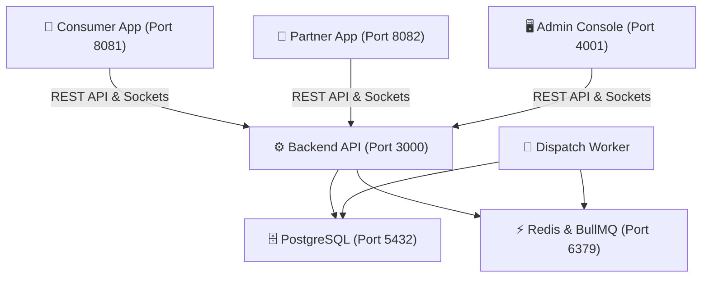
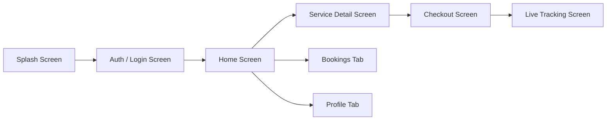
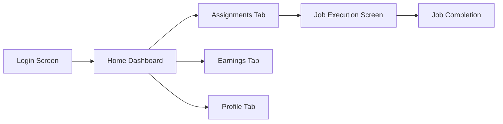
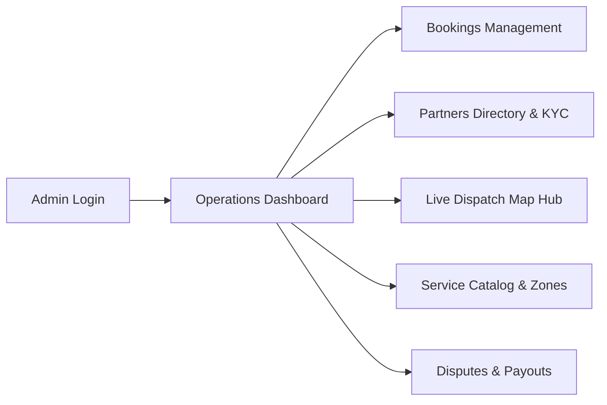

# 🗺️ Clenzey Complete System Flow & End-to-End Testing Map

This comprehensive map outlines all product screens, features, interactive buttons, data pathways, and simultaneous test procedures across the entire Clenzey ecosystem (**Consumer App**, **Partner App**, **Admin Console**, and **Backend Engine**).

---

## 🏗️ Part 1: System-Wide Architecture & Data Linkages

---

## 📱 Part 2: Consumer App Flow & Screen Map (`apps/consumer`)

### 1. Auth & Onboarding
- **Screen**: `/auth/login` & `/auth/register`
- **Elements & Buttons**:
  - `Identifier Input`: Accepts phone (`+919988776655`) or email.
  - `Password Input`: `Test@1234`.
  - `Sign In Button` $\rightarrow$ Validates JWT, sets state in Zustand, navigates to `/(tabs)`.

### 2. Home Tab (`/(tabs)/index.tsx`)
- **Elements & Buttons**:
  - `Location Header`: Displays current detected locality / city (Ahmedabad Central).
  - `Search Bar`: Filters services by name or category.
  - `Category Filter Chips`: **Deep Cleaning**, **Corporate**, **Regular**.
  - `Service List Cards`: Shows service image, title, starting price, and `View Details` action $\rightarrow$ Navigates to `/services/[id]`.

### 3. Service Detail Screen (`/services/[id].tsx`)
- **Elements & Buttons**:
  - `Booking Mode Segment Tabs`: **Instant Booking** vs **Schedule Later**.
  - `Variant Selector Cards`: Single-choice options (e.g., *1 BHK*, *2 BHK*, *3 BHK*, *Villa*).
  - `Add-on Selector Checkboxes`: Multi-choice add-ons (e.g., *Balcony Cleaning*, *Appliance Degreasing*).
  - `Inclusions / Exclusions Tabs`: Displays scope of work checklist.
  - `Sticky Bottom Bar`: Dynamic total amount calculator + `Proceed to Checkout` button $\rightarrow$ Navigates to `/booking/create`.

### 4. Checkout & Booking Creation (`/booking/create.tsx`)
- **Elements & Buttons**:
  - `Address Selector / Map Picker`: Shows saved address or opens Leaflet map picker.
  - `Date & Slot Picker`: Calendar day selector + morning/afternoon slot radio buttons.
  - `Coupon Code Input`: Apply `WELCOME50` or `CLEAN100` $\rightarrow$ Triggers live discount calculation.
  - `Payment Method Radio`: **Cash on Delivery** (`CASH`) or **Online Payment** (`RAZORPAY`).
  - `Confirm Booking Button` $\rightarrow$ Calls `POST /api/v1/bookings`, connects socket room, navigates to `/booking/[id]`.

### 5. Live Tracking & Booking Detail (`/booking/[id].tsx`)
- **Elements & Buttons**:
  - `Status Timeline Progress`: `CONFIRMED` $\rightarrow$ `ASSIGNED` $\rightarrow$ `EN_ROUTE` $\rightarrow$ `IN_PROGRESS` $\rightarrow$ `COMPLETED`.
  - `Partner Info Card`: Displays assigned partner name, photo, ratings, and vehicle details.
  - `4-Digit Check-In Start Code`: Visible to consumer only when partner is `EN_ROUTE` (shared with partner to begin job).
  - `Masked Calling Button`: Initiates privacy-safe call bridge.
  - `Cancel Booking Button`: Triggers refund/cancellation rule check.

---

## 🛵 Part 3: Partner App Flow & Screen Map (`apps/partner`)

### 1. Auth & Sign In
- **Screen**: `/auth/login`
- **Elements**: Phone input (`+919998887766`), password (`Test@1234`), `Sign In` button $\rightarrow$ Navigates to `/(tabs)`.

### 2. Home Tab (`/(tabs)/index.tsx`)
- **Elements & Buttons**:
  - `Online / Offline Toggle Switch`: Updates partner status in Redis & DB. Online partners receive auto-dispatch requests.
  - `Today's Metrics Card`: Shows completed trips count and daily earnings (₹).
  - `Active Job Banner`: If a job is currently active, displays direct shortcut to job screen.

### 3. Assignments Tab (`/(tabs)/assignments/index.tsx`)
- **Elements & Buttons**:
  - `New Job Offers`: Shows booking type, service variant, customer locality, and estimated payout.
  - `Accept Job Button` $\rightarrow$ Locks booking, updates status to `ASSIGNED`, broadcasts socket event.
  - `Decline Job Button` $\rightarrow$ Re-routes booking to next available partner in queue.

### 4. Active Job Execution Lifecycle (`/bookings/[id].tsx`)
- **Step 1 — Start Trip**: Partner taps **Start Trip (En Route)** $\rightarrow$ Status moves to `EN_ROUTE`. Consumer app gets notification.
- **Step 2 — Arrive**: Partner taps **Arrived at Location** $\rightarrow$ Status moves to `ARRIVED`.
- **Step 3 — Check-In Verification**: Partner asks consumer for 4-digit code and enters it into input $\rightarrow$ Status moves to `IN_PROGRESS`.
- **Step 4 — Completion**: Partner captures job photo and taps **Complete Service** $\rightarrow$ Status moves to `COMPLETED`, adds earnings to partner wallet ledger.

### 5. Earnings Tab (`/(tabs)/earnings/index.tsx`)
- **Elements**:
  - `Wallet Balance`: Shows available balance for payout.
  - `Past Trips Ledger`: Detailed breakdown per booking with incentive bonuses.

---

## 🖥️ Part 4: Admin Console Flow & Screen Map (`clenzey_admin`)

### 1. Admin Login (`http://localhost:4001/login`)
- **Credentials**: `superadmin` / `Admin@1234`.

### 2. Operations Dashboard (`/`)
- **Key Metrics**:
  - Total Bookings, Active Jobs, Online Partners Count, Total GMV.
  - Live socket connection indicator (green dot).

### 3. Bookings Management (`/bookings`)
- **Features**:
  - Search by Booking ID (e.g. `BK-E2E-0013`).
  - Filter by status tabs: `All`, `Confirmed`, `En Route`, `In Progress`, `Completed`, `Cancelled`.
  - Action buttons: View details, manual partner assign modal, issue refund.

### 4. Partners Management (`/partners`)
- **Features**:
  - List of all 12 partners.
  - Status badges: `APPROVED`, `PENDING_APPROVAL`, `REJECTED`.
  - Action button: Approve / Reject new applicants (`Kiran Joshi`), assign primary zone.

### 5. Live Dispatch Map Hub (`/dispatch`)
- **Features**:
  - Map showing real-time GPS locations of all online partners.
  - Side panel with unassigned booking queue.
  - `Trigger Scheduled Batch` button for manual test dispatch.

---

## ⚡ Part 5: Simultaneous Three-Party E2E Testing Script

Run this test script to see all three systems (**Consumer**, **Partner**, **Admin**) interact in real time:

| Step | Action by Actor | Where to Perform | What Happens Across the System |
|---|---|---|---|
| **1** | **Admin Check** | Browser (`http://localhost:4001/dispatch`) | Verify online partners are shown on the dispatch map. |
| **2** | **Partner Goes Online** | Partner App (`http://localhost:8082`) | Log in as `+919998887766` / `Test@1234`. Toggle **Online** switch to Active. |
| **3** | **Consumer Creates Booking** | Consumer App (`http://localhost:8081`) | Log in as `+919988776655` / `Test@1234`. Pick **Deep Cleaning** $\rightarrow$ select Instant Booking $\rightarrow$ Cash $\rightarrow$ click **Confirm Booking**. |
| **4** | **Dispatch & Assignment** | Automatic Backend Engine | Worker auto-matches partner Amit Sharma $\rightarrow$ Sends assignment socket event to Partner App. |
| **5** | **Partner Accepts** | Partner App (`http://localhost:8082`) | Tap **Accept Job** under Assignments tab. |
| **6** | **Partner Starts Trip** | Partner App | Tap **Start Trip**. Consumer app immediately updates status to **En Route** and reveals 4-digit start code. |
| **7** | **Job Check-In** | Partner App | Tap **Arrived**, enter the 4-digit code shown on the Consumer's phone, tap **Verify & Start**. Status becomes **In Progress**. |
| **8** | **Job Completion** | Partner App | Tap **Complete Job**. Partner earnings increase, Consumer receives completion invoice, Admin console marks booking **Completed**. |

---

## 📁 File Reference

- **Changelog**: `changes/CHANGES_LOG.md`
- **Testing Map**: `testing/SYSTEM_FLOW_AND_TESTING_MAP.md`
- **Architecture Overview**: `docs/architecture/`
